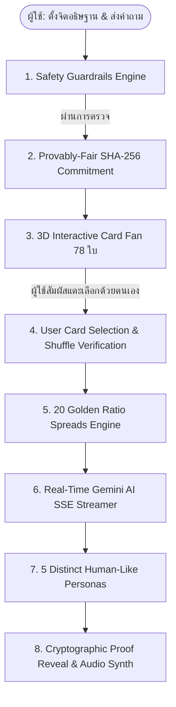
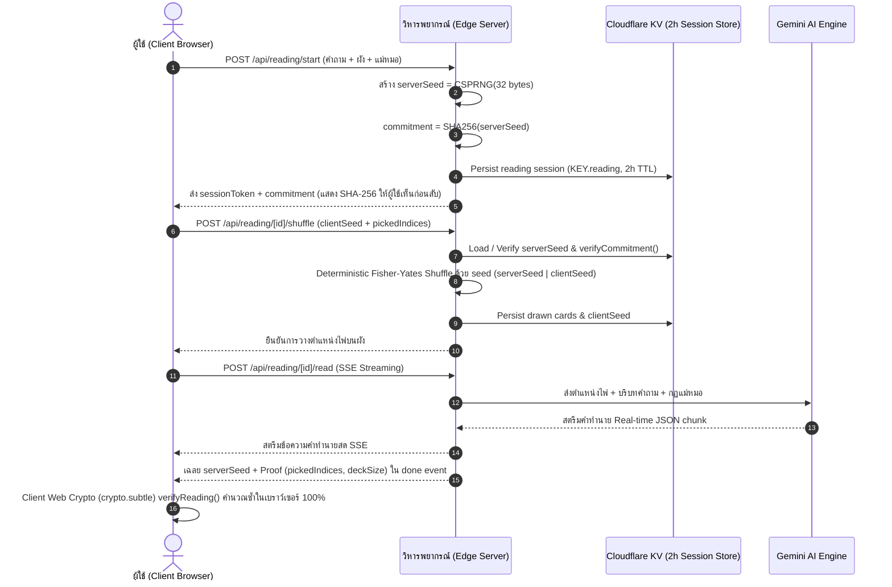

# 🔮 สถาปัตยกรรมระบบเว็บดูดวงไพ่ทาโรต์ระดับองค์กร (Enterprise Architecture Blueprint)

เอกสารฉบับนี้สรุปภาพรวมทางสถาปัตยกรรมระดับองค์กร (Enterprise Architecture), กลไกการเข้ารหัสความโปร่งใส (Cryptographic Provably-Fair Security), ระบบประมวลผล Edge Computing บน Cloudflare Workers, และระเบียบวิศวกรรมระดับโลก เพื่อให้ทีมวิศวกรและ AI Agents สามารถต่อยอดระบบได้อย่างไร้รอยต่อ

---

## 1. ปรัชญาและกฎเหล็กของระบบ (Core Engineering Philosophy)



1. **AI ไม่เคยเป็นคนจั่วไพ่ (AI Never Draws Cards)**:
   - ลำดับไพ่ถูกกำหนดโดยการกระทำจริงของผู้ใช้ (สัมผัส/เลือกไพ่/สับไพ่) ร่วมกับระบบสุ่มที่พิสูจน์ได้ทางคณิตศาสตร์ (Provably Fair)
   - โมเดล AI ทำหน้าที่เป็น **"ผู้อ่านและตีความ (Interpreter/Reader)"** ตามตำแหน่งและหน้าไพ่จริงเท่านั้น ห้ามสลับไพ่หรือแต่งไพ่ขึ้นมาเอง
2. **สัมผัสและเลือกไพ่ด้วยตนเอง (Manual Self-Reveal & Interactive Fan)**:
   - ผู้ใช้เป็นผู้เลือกและพลิกไพ่ 3D ด้วยตนเองเพื่อสร้างความรู้สึกสมจริงและเป็นธรรมชาติ
3. **ความโปร่งใสที่ตรวจสอบได้ด้วยวิทยาการรหัสลับ (SHA-256 Commit-Reveal)**:
   - เซิร์ฟเวอร์สร้าง `serverSeed` และส่งแฮช `commitment = SHA256(serverSeed + ":" + clientSeed)` ให้เบราว์เซอร์ก่อนเริ่มแตะไพ่
   - เมื่ออ่านเสร็จ เซิร์ฟเวอร์เฉลย `serverSeed` ให้ผู้ใช้ตรวจคำนวณย้อนหลังได้ 100% ว่าไม่มีการบิดเบือนผล
4. **ความปลอดภัยและจริยธรรม (Safety & Compassionate Guardrails)**:
   - กรองคำถามอันตราย (ความรุนแรง/การแพทย์/การพนัน/ทำร้ายตัวเอง) และแสดงสายด่วนสุขภาพจิต **1323** ทันที

---

## 2. โครงสร้าง Tech Stack & Infrastructure

| Layer | เทคโนโลยี | วัตถุประสงค์และจุดเด่น |
| :--- | :--- | :--- |
| **Edge Compute** | **Cloudflare Workers (OpenNext v1.20)** | Zero-Cold-Start Serverless Edge Network ทั่วโลก |
| **Database** | **Cloudflare D1 (`APP_DB`) + Cloudflare KV** | Relational Database สำหรับระบบแม่หมอ Marketplace และ KV สำหรับ Caching/Audit |
| **Framework** | **Next.js 16.3 (App Router) + React 19** | Hybrid Static/Dynamic Routing + Server-Sent Events (SSE) |
| **Language** | **TypeScript 7 (Strict Mode)** | ความปลอดภัยระดับ 0 Type Errors 100% |
| **Design & UI** | **Tailwind CSS v4 + Motion v13** | Mystical Obsidian Velvet & Gold Leaf Theme + GPU-Accelerated Animations |
| **Asset Pipeline** | **4-Tier WebP/AVIF Remastered (`w128`, `w256`, `w512`, `w1024`)** | ลดขนาด Asset 85% คมชัดระดับ Retina |
| **AI LLM Engine** | **Google Gemini (`gemini-2.5-flash / pro`)** | Real-time SSE Streaming พร้อม Structured JSON Validation |
| **Validation** | **Zod v4** | Schema Validation แบบ Strict ป้องกันความผิดพลาดของ Input/Output |

---

## 3. แผนผังการทำงานของ 5 บุคลิกแม่หมอ (5 Tarot Reader Personas)

ระบบมีแม่หมอ 5 บุคลิกที่ตอบโจทย์ความต้องการของผู้ใช้ทุกกลุ่ม พร้อมระบบตรวจจับเจตนาของผู้ใช้ (Intent Classification Engine):

| บุคลิก (Persona) | ฉายา / อาร์คิไทป์ | ภาพไพ่ประจำตัว | สไตล์และน้ำเสียง |
| :--- | :--- | :--- | :--- |
| **`warm`** | **แม่หมอใจดี** (The High Priestess) | `major-02.jpg` | อบอุ่น นุ่มนวล โอบกอดความรู้สึกเหมือนพี่สาวคนสนิท |
| **`playful`** | **แม่หมอเพื่อนซี้** (The Magician) | `major-01.jpg` | คุยสนุก เป็นกันเอง มีอารมณ์ขัน เม้าท์มันส์ ให้กำลังใจแบบเพื่อนสนิท |
| **`direct`** | **แม่หมอพูดตรง** (Justice & Truth) | `major-11.jpg` | ตรงไปตรงมา กระชับ เด็ดขาด ชี้จุดที่ต้องตื่นรู้เพื่อให้ชีวิตไปต่อได้จริง |
| **`master`** | **อาจารย์สายฟันธง** (The Master Strategist) | `major-09.jpg` | จริงจัง สุขุม ทรงภูมิ ให้กลยุทธ์และ Action Plan 1-2-3 ชัดเจน |
| **`mystic`** | **แม่หมอสายพลัง** (The Astral Star) | `major-17.jpg` | สุขุม ลึกซึ้ง อ่านคลื่นพลังงาน จังหวะจักรวาล และบทเรียนจิตวิญญาณ |

---

## 4. 20 ผังพยากรณ์ยอดนิยม (Golden Ratio 20 Spreads Architecture)

ระบบรองรับผังการเปิดไพ่ 20 แบบ ครอบคลุม 4 หมวดหมู่ จัดวางด้วยสัดส่วนทองคำแบบ **Zero-Clipping Unified Altar Canvas**:

1. **ผัง 1 ใบ**: ไพ่ประจำวัน (Daily Card), คำแนะนำด่วน (Quick Oracle), ใช่หรือไม่ (Yes/No Single)
2. **ผัง 2 ใบ**: ทางแยกสองทาง (Two Paths), ความรักสองหัวใจ (Two Hearts)
3. **ผัง 3 ใบ**: อดีต-ปัจจุบัน-อนาคต (Past-Present-Future), จิตใจ-ร่างกาย-วิญญาณ (Mind-Body-Spirit), สถานการณ์-อุปสรรค-ทางออก (Situation-Challenge-Advice), ใช่หรือไม่ 3 ใบ (Yes/No Triad)
4. **ผัง 4 ใบ**: 4 ทิศทางชีวิต (Four Directions), แฟนเก่าจะกลับมาไหม (Reunion Path), เช็คดวงการงาน (Career Outlook)
5. **ผัง 5 ใบ**: กางเขนธาตุทั้งห้า (Elemental Cross), การเงินมหาเศรษฐี (Wealth & Abundance), ความในใจของเขา (Inner Thoughts)
6. **ผัง 6 ใบ**: พลังงานรายสัปดาห์ (Weekly Energy)
7. **ผัง 7 ใบ**: ดวงชะตา 7 วัน (7-Day Forecast), สแกนสมดุล 7 จักระ (7 Chakras Balance)
8. **ผัง 10 ใบ**: เคลติกครอสโบราณ (Celtic Cross Grand Spread), ส่องเส้นทางชีวิต 10 มิติ (Tree of Life)

---

## 5. การเข้ารหัสความโปร่งใส (Provably Fair Cryptographic Flow)



---

## 6. สถาปัตยกรรมโครงสร้างไฟล์ในโปรเจกต์ (Codebase Topology)

```text
src/
├── app/
│   ├── api/reading/
│   │   ├── start/route.ts           # เริ่มต้นรอบ ตรวจ Safety และสร้าง SHA-256 Commitment
│   │   ├── [id]/shuffle/route.ts    # คำนวณ Shuffle ตาม pickedIndices
│   │   ├── [id]/read/route.ts       # สตรีมคำอ่านผ่าน Server-Sent Events (SSE)
│   │   └── [id]/chat/route.ts       # ถามคุยต่อยอดตามบริบทไพ่และ 5 บุคลิก
│   ├── cards/                       # สารานุกรมไพ่ 78 ใบ (/cards และ /cards/[id])
│   ├── spreads/                     # คลังผังพยากรณ์ 20 แบบ
│   ├── blog/, privacy/, account/    # หน้าเนื้อหา นโยบาย PDPA และจัดการบัญชี
│   ├── page.tsx                     # วิหารพยากรณ์หลัก (5-Step Ritual Flow)
│   └── globals.css                  # Obsidian Velvet & Gold Design System + GPU Classes
├── components/
│   ├── card/                        # TarotCard 3D, CardImage (WebP/AVIF), CardZoomModal
│   ├── deck/                        # InteractiveCardFan (78 ใบ), ShuffleRitual
│   ├── spread/                      # SpreadBoard, SpreadCardSelector (20 ผัง)
│   ├── reading/                     # StreamReader, FollowUpChat, ShareModal, PersonaCardSelector
│   ├── history/, encyclopedia/      # ReadingHistoryModal, TarotEncyclopediaModal
│   └── ui/                          # MysticAltarCanvas, TarotArtIcons, RitualStepProgress
├── data/
│   ├── cards/                       # ข้อมูลไพ่ 78 ใบ (780 ข้อความความหมาย 5 มิติ)
│   ├── spreads.ts                   # ข้อมูล 20 ผังพยากรณ์และ 95 ตำแหน่ง
│   └── personas.ts                  # แม่หมอ 5 บุคลิก (warm, playful, direct, master, mystic)
├── lib/
│   ├── ai/                          # Gemini SSE Streaming & Structured Output Parser
│   ├── safety/                      # Guardrails กรองคำถามอันตราย & 1323
│   ├── security/                    # Session Token & Stateless HMAC Signature
│   └── tarot/                       # Provably Fair Shuffle & Single Source Card Resolver
```

---

## 8. ระบบความปลอดภัยและการควบคุมต้นทุน AI 7 ชั้น (7-Layer Defense-in-Depth & Cost Control)

เพื่อป้องกันการยิง API ซ้ำซ้อน, การถูก Bot Scraping และการสูญเสียงบประมาณโมเดล AI (Gemini 3.7 Flash) โดยไม่ทำลายบรรยากาศการเปิดไพ่ด้วย Captcha (ADR-002):

1. **Provably Fair Entropy Binding**: การสับไพ่ผูกกับ `clientSeed` และ `pickedIndices` ของผู้ใช้จริง บอทไม่สามารถยิงลัดขั้นตอนได้
2. **Strict Origin & Anti-Theft Guard (`anti-theft.ts`)**: ตรวจสอบ `Sec-Fetch-Site` และ `Origin` ป้องกันการขโมย API ไปใช้ในเว็บภายนอก
3. **Privileged Testing Bypass (`privileged.ts`)**: รองรับการทดสอบอัตโนมัติของทีมและ CI ผ่าน Admin Cookie และ Header `X-Tarot-Bypass: RATE_LIMIT_BYPASS_TOKEN`
4. **Sliding Window Rate Limiter (`rate-limit.ts`)**: จำกัดความถี่คำขอต่อ IP แบบ Sliding Window พร้อม Single-Flight Concurrency Lock
5. **Edge KV Cross-Fleet Soft Quota (`ai-budget.ts`)**: จำกัดโควตารายวันต่อ IP (40 ครั้ง/วัน) ซิงก์ข้าม Edge isolate ด้วย SHA-256 IP Hash
6. **AI Daily Spend Cap & Circuit Breaker (`ai-budget.ts`)**: เพดานงบประมาณ Gemini ประจำวัน (`AI_DAILY_CALL_CAP`) พร้อมตัดวงจรคืนค่า HTTP 503 บน `/read` และ fallback สู่ Local Synthesis อัตโนมัติบน `/chat`
7. **Cloudflare Native WAF Rate Limiting**: บล็อกสแปมและทราฟฟิกผิดปกติตั้งแต่ระดับ DNS Edge ก่อนเข้าถึง Cloudflare Worker

---

## 9. ระบบยืนยันตัวตนด้วยอีเมลและรหัสผ่าน (Email & Password Authentication Architecture)

เพื่อมอบทางเลือกให้กับผู้ใช้ที่ไม่ได้ใช้งาน Google หรือ LINE OAuth ระบบรองรับ Email/Password Authentication ภายใต้มาตรฐานความปลอดภัยระดับสูง:

1. **PBKDF2-HMAC-SHA256 Password Hashing (`password.ts`)**:
   - 150,000 iterations, 32-byte derived key, 16-byte random salt ต่อผู้ใช้
   - ผสม Server-side Pepper (`PASSWORD_PEPPER`) บน Web Crypto API ทำงานได้รวดเร็วบน Cloudflare Workers
   - Constant-time verification (`timingSafeEqualBytes`) ป้องกัน Timing Attack
2. **NIST 2024 Password Policy (`password-policy.ts`)**:
   - ความยาว 10–200 ตัวอักษร, ปฏิเสธรหัสผ่านยอดนิยม (Common Passwords) และรหัสผ่านที่ซ้ำกับชื่ออีเมล
3. **Single-Use Token Lifecycle (`auth-tokens.repo.ts`)**:
   - จัดเก็บเฉพาะ SHA-256 Hash ของ Token ในฐานข้อมูล D1 (`auth_tokens`)
   - Verification Token (TTL 24 ชม.), Reset Token (TTL 15 นาที)
   - ป้องกัน Replay Attack โดยทำเครื่องหมาย `used_at` ทันทีเมื่อถูกใช้งาน
4. **Anti-Enumeration Protection**:
   - API endpoints ตอบข้อความมาตรฐานแบบ generic แม้อีเมลจะไม่มีอยู่ในระบบ เพื่อป้องกันการกวาดรายชื่อผู้ใช้
5. **OAuth Account Linking (`oauth_identities`)**:
   - เมื่อผู้ใช้เข้าสู่ระบบด้วย Google หรือ LINE ที่มีอีเมลตรงกับบัญชีเดิม ระบบจะเชื่อมโยง Provider Identity เข้ากับบัญชีเดิมให้อัตโนมัติโดยไม่สร้างบัญชีซ้ำซ้อน
6. **Session Invalidation via `token_version`**:
   - ทุกครั้งที่มีการเปลี่ยนหรือรีเซ็ตรหัสผ่าน ค่า `token_version` ในฐานข้อมูลจะถูกเพิ่มขึ้น 1 ทำให้เซสชันเดิมบนอุปกรณ์อื่นทั้งหมดถูกเพิกถอนทันที

## 10. แผนที่ตัวแปรแวดล้อมระบบจริง (Environment Variables Map)

ตารางต่อไปนี้แสดงรายการตัวแปรแวดล้อม (Environment Variables & Cloudflare Secrets) ทั้งหมดที่ใช้งานจริงในระบบ ความสำคัญ แหล่งจัดเก็บ และไฟล์ที่เรียกใช้งาน:

| ตัวแปร (Variable Name) | บทบาทหน้าที่ | ระดับความสำคัญ | แหล่งจัดเก็บ (Production / Local) | ไฟล์ที่เรียกใช้งานจริง |
| :--- | :--- | :---: | :--- | :--- |
| **`GEMINI_API_KEY`**<br>`(หรือ GOOGLE_API_KEY)` | คีย์เชื่อมต่อ Google Gemini (3.7 / 2.5 Flash) เพื่อสตรีมคำทำนายไพ่และตอบแชท | 🔴 **จำเป็นสำหรับ AI จริง** *(มีคลังสำรองออฟไลน์หากไม่มี)* | Cloudflare Secret (`wrangler secret put`) / `.env.local` | `src/app/api/reading/[id]/read/route.ts`<br>`src/app/api/reading/[id]/chat/route.ts`<br>`src/app/api/admin/ai-health/route.ts`<br>`src/lib/ai/gemini.ts` |
| **`GROQ_API_KEY`** | คีย์เชื่อมต่อ Groq Cloud LPU เพื่อเป็นระบบ AI สำรองความเร็วสูง (400ms) เมื่อ Gemini ชนโควตา | 🟡 **แนะนำสูง** *(ระบบสองประสาน)* | Cloudflare Secret (`wrangler secret put`) / `.env.local` | `src/lib/ai/groq.ts`<br>`src/app/api/reading/[id]/chat/route.ts`<br>`src/app/api/admin/ai-health/route.ts` |
| **`SESSION_SECRET`** | คีย์ลับสำหรับลงนามและเข้ารหัส Session Token ของการเปิดไพ่ ป้องกันการดัดแปลงสถานะ | 🔴 **จำเป็นสำหรับความปลอดภัย** | Cloudflare Secret / `.env.local` | `src/lib/security/session.ts`<br>`src/lib/security/privileged.ts` |
| **`JWT_SECRET`** | คีย์ลับสำหรับลงนามและตรวจสอบสิทธิ์ JSON Web Token ของบัญชีผู้ใช้งาน | 🔴 **จำเป็นสำหรับระบบสมาชิก** | Cloudflare Secret / `.env.local` | `src/lib/auth/jwt.ts`<br>`src/app/api/auth/*` |
| **`PASSWORD_PEPPER`** | ค่า Pepper ฝั่งเซิร์ฟเวอร์สำหรับผสมในการแฮชรหัสผ่าน PBKDF2-HMAC-SHA256 | 🔴 **จำเป็นสำหรับความปลอดภัย** | Cloudflare Secret / `.env.local` | `src/lib/auth/password.ts` |
| **`ADMIN_PASSWORD`** | รหัสผ่านสำหรับเข้าสู่ระบบแผงควบคุมผู้ดูแลระบบหลังบ้าน (`/admin`) | 🔴 **จำเป็นสำหรับแอดมิน** | Cloudflare Secret / `.env.local` | `src/lib/security/admin-auth.ts`<br>`src/app/api/admin/login/route.ts` |
| **`ADMIN_TOKEN`** | Bearer Token สำหรับยืนยันตัวตนแอดมินผ่าน HTTP Header ในการเรียก Admin APIs | 🟡 **แนะนำสำหรับแอดมิน** | Cloudflare Secret / `.env.local` | `src/lib/security/admin-auth.ts` |
| **`RATE_LIMIT_BYPASS_TOKEN`** | โทเคนลับสำหรับให้ระบบ CI / Automated Testing รันข้าม Rate Limit ได้อย่างปลอดภัย | 🟢 **ใช้ใน CI / Testing** | GitHub Actions Secret / Cloudflare Secret | `src/lib/security/privileged.ts`<br>`.github/workflows/*` |
| **`AI_DAILY_CALL_CAP`** | ตัวเลขจำกัดเพดานการเรียก AI รายวันเพื่อควบคุมค่าใช้จ่าย (ค่าเริ่มต้น: 500) | 🟢 **ตัวเลือกปรับแต่ง** | Cloudflare Environment Variable | `src/lib/security/ai-budget.ts` |
| **`APP_DB`** *(Binding)* | Cloudflare D1 Database Binding สำหรับเก็บข้อมูลสมาชิก, ประวัติดูดวง, และบันทึกสิทธิ์ | 🔴 **จำเป็นบน Production** *(Local ใช้ SQLite Mock)* | `wrangler.jsonc` (`d1_databases`) | `src/lib/platform/db.ts`<br>`src/server/db/*` |
| **`APP_KV`** *(Binding)* | Cloudflare KV Namespace Binding สำหรับเก็บแคชชั่วคราว, Rate Limit, และ AI Budget | 🔴 **จำเป็นบน Production** *(Local ใช้ In-Memory Mock)* | `wrangler.jsonc` (`kv_namespaces`) | `src/lib/platform/kv.ts`<br>`src/lib/security/ai-budget.ts` |

---

## 11. บันทึกการตัดสินใจทางสถาปัตยกรรม (Architecture Decision Records - ADR Index)

การตัดสินใจสำคัญด้านโครงสร้างและเทคโนโลยีทั้งหมดได้รับการบันทึกอย่างเป็นทางการในโฟลเดอร์ [`docs/adr/`](adr/):

* **[ADR-001: สถาปัตยกรรม Marketplace แม่หมอและการคุ้มครองข้อมูลส่วนบุคคล (PDPA Architecture & Compliance)](adr/ADR-001-marketplace-pdpa.md)** — การแยกชั้นข้อมูลอ่อนไหว, Data Minimization, และการส่งต่อ Off-Platform
* **[ADR-002: กลยุทธ์ป้องกันบอทและการควบคุมต้นทุน AI โดยไม่ทำลายประสบการณ์ผู้ใช้](adr/ADR-002-bot-challenge.md)** — การควบคุมค่าใช้จ่ายและการป้องกันบอท 7 ชั้นโดยไม่ใช้ Captcha รบกวนผู้ใช้
* **[ADR-003: เหตุผลการเลือกใช้เทคโนโลยีเวอร์ชันล้ำสมัยและการบริหารความเสี่ยง (Cutting-Edge Stack Rationale & Risk Management)](adr/ADR-003-cutting-edge-stack-rationale.md)** — การเลือกใช้ `React 19.2`, `Next.js 16.3`, และ `Motion 13` เพื่อ 60fps Animation บน Edge พร้อมมาตรการรับมือความเสี่ยง

---

ระบบถูกออกแบบภายใต้มาตรฐานความน่าเชื่อถือระดับสูง (High Reliability & Fault Tolerance) เพื่อมอบประสบการณ์ดูดวงไพ่ทาโรต์ออนไลน์ที่ดีที่สุดในระดับสากล ✦


