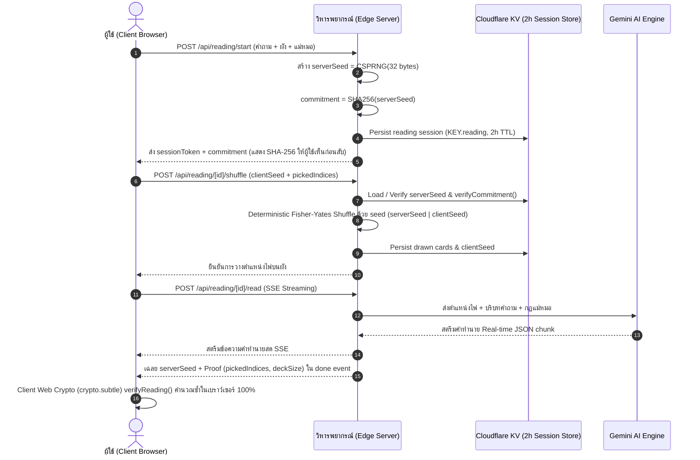

# 🔮 สถาปัตยกรรมระบบเว็บดูดวงไพ่ทาโรต์ระดับองค์กร (Enterprise Architecture Blueprint)

เอกสารฉบับนี้สรุปภาพรวมทางสถาปัตยกรรมระดับองค์กร (Enterprise Architecture), กลไกการเข้ารหัสความโปร่งใส (Cryptographic Provably-Fair Security), ระบบประมวลผล Edge Computing บน Cloudflare Workers, และระเบียบวิศวกรรมระดับโลก เพื่อให้ทีมวิศวกรและ AI Agents สามารถต่อยอดระบบได้อย่างไร้รอยต่อ

---

## 1. ปรัชญาและกฎเหล็กของระบบ (Core Engineering Philosophy)


1. **AI ไม่เคยเป็นคนจั่วไพ่ (AI Never Draws Cards)**:
   - ลำดับไพ่ถูกกำหนดโดยการกระทำจริงของผู้ใช้ (สัมผัส/เลือกไพ่/สับไพ่) ร่วมกับระบบสุ่มที่พิสูจน์ได้ทางคณิตศาสตร์ (Provably Fair)
   - โมเดล AI ทำหน้าที่เป็น **"ผู้อ่านและตีความ (Interpreter/Reader)"** ตามตำแหน่งและหน้าไพ่จริงเท่านั้น ห้ามสลับไพ่หรือแต่งไพ่ขึ้นมาเอง
2. **สัมผัสและเลือกไพ่ด้วยตนเอง (Manual Self-Reveal & Interactive Fan)**:
   - ผู้ใช้เป็นผู้เลือกและพลิกไพ่ 3D ด้วยตนเองเพื่อสร้างความรู้สึกสมจริงและเป็นธรรมชาติ
3. **ความโปร่งใสที่ตรวจสอบได้ด้วยวิทยาการรหัสลับ (SHA-256 Commit-Reveal)**:
   - เซิร์ฟเวอร์สร้าง `serverSeed` และส่งแฮช `commitment = SHA256(serverSeed + ":" + clientSeed)` ให้เบราว์เซอร์ก่อนเริ่มแตะไพ่
   - เมื่ออ่านเสร็จ เซิร์ฟเวอร์เฉลย `serverSeed` ให้ผู้ใช้ตรวจคำนวณย้อนหลังได้ 100% ว่าไม่มีการบิดเบือนผล
4. **ความปลอดภัยและจริยธรรม (Safety & Compassionate Guardrails)**:
   - กรองคำถามอันตราย (ความรุนแรง/การแพทย์/การพนัน/ทำร้ายตัวเอง) และแสดงสายด่วนสุขภาพจิต **1323** ทันที

---

## 2. โครงสร้าง Tech Stack & Infrastructure

| Layer | เทคโนโลยี | วัตถุประสงค์และจุดเด่น |
| :--- | :--- | :--- |
| **Edge Compute** | **Cloudflare Workers (OpenNext v1.20)** | Zero-Cold-Start Serverless Edge Network ทั่วโลก |
| **Database** | **Cloudflare D1 (`APP_DB`) + Cloudflare KV** | Relational Database สำหรับระบบแม่หมอ Marketplace และ KV สำหรับ Caching/Audit |
| **Framework** | **Next.js 16.3 (App Router) + React 19** | Hybrid Static/Dynamic Routing + Server-Sent Events (SSE) |
| **Language** | **TypeScript 7 (Strict Mode)** | ความปลอดภัยระดับ 0 Type Errors 100% |
| **Design & UI** | **Tailwind CSS v4 + Motion v13** | Mystical Obsidian Velvet & Gold Leaf Theme + GPU-Accelerated Animations |
| **Asset Pipeline** | **4-Tier WebP/AVIF Remastered (`w128`, `w256`, `w512`, `w1024`)** | ลดขนาด Asset 85% คมชัดระดับ Retina |
| **AI LLM Engine** | **Google Gemini (`gemini-2.5-flash / pro`)** | Real-time SSE Streaming พร้อม Structured JSON Validation |
| **Validation** | **Zod v4** | Schema Validation แบบ Strict ป้องกันความผิดพลาดของ Input/Output |

---

## 3. แผนผังการทำงานของ 5 บุคลิกแม่หมอ (5 Tarot Reader Personas)

ระบบมีแม่หมอ 5 บุคลิกที่ตอบโจทย์ความต้องการของผู้ใช้ทุกกลุ่ม พร้อมระบบตรวจจับเจตนาของผู้ใช้ (Intent Classification Engine):

| บุคลิก (Persona) | ฉายา / อาร์คิไทป์ | ภาพไพ่ประจำตัว | สไตล์และน้ำเสียง |
| :--- | :--- | :--- | :--- |
| **`warm`** | **แม่หมอใจดี** (The High Priestess) | `major-02.jpg` | อบอุ่น นุ่มนวล โอบกอดความรู้สึกเหมือนพี่สาวคนสนิท |
| **`playful`** | **แม่หมอเพื่อนซี้** (The Magician) | `major-01.jpg` | คุยสนุก เป็นกันเอง มีอารมณ์ขัน เม้าท์มันส์ ให้กำลังใจแบบเพื่อนสนิท |
| **`direct`** | **แม่หมอพูดตรง** (Justice & Truth) | `major-11.jpg` | ตรงไปตรงมา กระชับ เด็ดขาด ชี้จุดที่ต้องตื่นรู้เพื่อให้ชีวิตไปต่อได้จริง |
| **`master`** | **อาจารย์สายฟันธง** (The Master Strategist) | `major-09.jpg` | จริงจัง สุขุม ทรงภูมิ ให้กลยุทธ์และ Action Plan 1-2-3 ชัดเจน |
| **`mystic`** | **แม่หมอสายพลัง** (The Astral Star) | `major-17.jpg` | สุขุม ลึกซึ้ง อ่านคลื่นพลังงาน จังหวะจักรวาล และบทเรียนจิตวิญญาณ |

---

## 4. 20 ผังพยากรณ์ยอดนิยม (Golden Ratio 20 Spreads Architecture)

ระบบรองรับผังการเปิดไพ่ 20 แบบ ครอบคลุม 4 หมวดหมู่ จัดวางด้วยสัดส่วนทองคำแบบ **Zero-Clipping Unified Altar Canvas**:

1. **ผัง 1 ใบ**: ไพ่ประจำวัน (Daily Card), คำแนะนำด่วน (Quick Oracle), ใช่หรือไม่ (Yes/No Single)
2. **ผัง 2 ใบ**: ทางแยกสองทาง (Two Paths), ความรักสองหัวใจ (Two Hearts)
3. **ผัง 3 ใบ**: อดีต-ปัจจุบัน-อนาคต (Past-Present-Future), จิตใจ-ร่างกาย-วิญญาณ (Mind-Body-Spirit), สถานการณ์-อุปสรรค-ทางออก (Situation-Challenge-Advice), ใช่หรือไม่ 3 ใบ (Yes/No Triad)
4. **ผัง 4 ใบ**: 4 ทิศทางชีวิต (Four Directions), แฟนเก่าจะกลับมาไหม (Reunion Path), เช็คดวงการงาน (Career Outlook)
5. **ผัง 5 ใบ**: กางเขนธาตุทั้งห้า (Elemental Cross), การเงินมหาเศรษฐี (Wealth & Abundance), ความในใจของเขา (Inner Thoughts)
6. **ผัง 6 ใบ**: พลังงานรายสัปดาห์ (Weekly Energy)
7. **ผัง 7 ใบ**: ดวงชะตา 7 วัน (7-Day Forecast), สแกนสมดุล 7 จักระ (7 Chakras Balance)
8. **ผัง 10 ใบ**: เคลติกครอสโบราณ (Celtic Cross Grand Spread), ส่องเส้นทางชีวิต 10 มิติ (Tree of Life)

---

## 5. การเข้ารหัสความโปร่งใส (Provably Fair Cryptographic Flow)



---

## 6. สถาปัตยกรรมโครงสร้างไฟล์ในโปรเจกต์ (Codebase Topology)

```text
src/
├── app/
│   ├── api/reading/
│   │   ├── start/route.ts           # เริ่มต้นรอบ ตรวจ Safety และสร้าง SHA-256 Commitment
│   │   ├── [id]/shuffle/route.ts    # คำนวณ Shuffle ตาม pickedIndices
│   │   ├── [id]/read/route.ts       # สตรีมคำอ่านผ่าน Server-Sent Events (SSE)
│   │   └── [id]/chat/route.ts       # ถามคุยต่อยอดตามบริบทไพ่และ 5 บุคลิก
│   ├── cards/                       # สารานุกรมไพ่ 78 ใบ (/cards และ /cards/[id])
│   ├── spreads/                     # คลังผังพยากรณ์ 20 แบบ
│   ├── blog/, privacy/, account/    # หน้าเนื้อหา นโยบาย PDPA และจัดการบัญชี
│   ├── page.tsx                     # วิหารพยากรณ์หลัก (5-Step Ritual Flow)
│   └── globals.css                  # Obsidian Velvet & Gold Design System + GPU Classes
├── components/
│   ├── card/                        # TarotCard 3D, CardImage (WebP/AVIF), CardZoomModal
│   ├── deck/                        # InteractiveCardFan (78 ใบ), ShuffleRitual
│   ├── spread/                      # SpreadBoard, SpreadCardSelector (20 ผัง)
│   ├── reading/                     # StreamReader, FollowUpChat, ShareModal, PersonaCardSelector
│   ├── history/, encyclopedia/      # ReadingHistoryModal, TarotEncyclopediaModal
│   └── ui/                          # MysticAltarCanvas, TarotArtIcons, RitualStepProgress
├── data/
│   ├── cards/                       # ข้อมูลไพ่ 78 ใบ (780 ข้อความความหมาย 5 มิติ)
│   ├── spreads.ts                   # ข้อมูล 20 ผังพยากรณ์และ 95 ตำแหน่ง
│   └── personas.ts                  # แม่หมอ 5 บุคลิก (warm, playful, direct, master, mystic)
├── lib/
│   ├── ai/                          # Gemini SSE Streaming & Structured Output Parser
│   ├── safety/                      # Guardrails กรองคำถามอันตราย & 1323
│   ├── security/                    # Session Token & Stateless HMAC Signature
│   └── tarot/                       # Provably Fair Shuffle & Single Source Card Resolver
```

---

## 7. ระเบียบวิศวกรรมการตรวจสอบ 7 ด่าน (7-Stage Verification Protocol)

ก่อนการ Commit หรือ Deploy ทุกครั้ง โค้ดต้องผ่านการตรวจครบ 7 ด่านผ่านคำสั่ง `npm run repo:verify`:

1. 🛡️ **AI Agent Collision Guard**: ป้องกันการแก้ไขไฟล์ชนกันระหว่างหลาย Agent
2. 🔍 **TypeScript Strict Typecheck**: การันตี 0 Type Errors 100%
3. 🃏 **78 Cards Database Integrity**: ตรวจสอบความครบถ้วน 780 ข้อความ 5 มิติ
4. 📐 **20 Spreads Geometry Calibration**: ตรวจสอบพิกัด 95 ตำแหน่งไร้การทับซ้อน
5. 🚨 **Safety Guardrails Filter**: ตรวจสอบการบล็อกคำถามอันตราย
6. 🎲 **Provably Fair Cryptographic Engine**: ทดสอบความยุติธรรมของระบบสับไพ่
7. 🖼️ **Card Image Path Guard**: ตรวจสอบการโหลดรูปผ่าน Single Pipeline ป้องกัน Error 404

ระบบถูกออกแบบภายใต้มาตรฐานความน่าเชื่อถือระดับสูง (High Reliability & Fault Tolerance) เพื่อมอบประสบการณ์ดูดวงไพ่ทาโรต์ออนไลน์ที่ดีที่สุดในระดับสากล ✦
