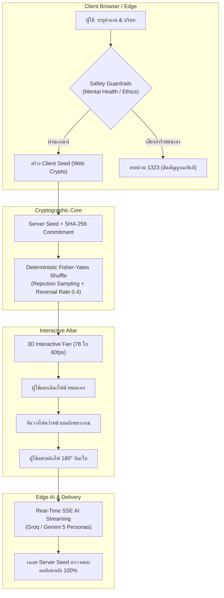
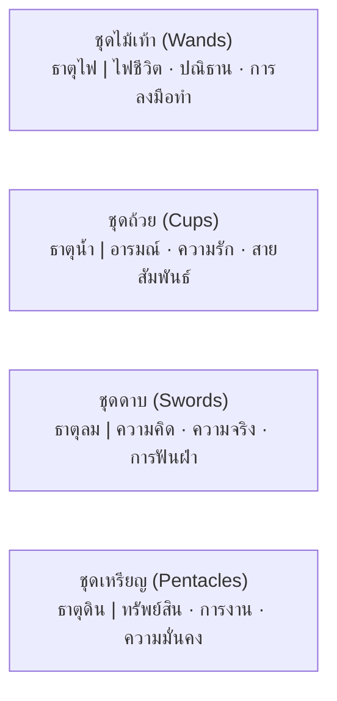
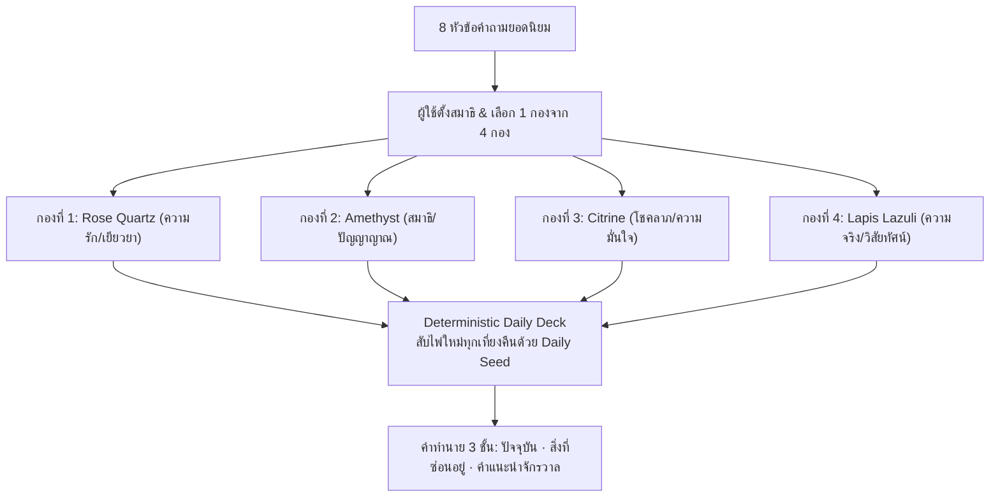

# ข้อกำหนดระบบและสารบบความสามารถไพ่ทาโรต์ระดับเวิลด์คลาส
## Enterprise Tarot Domain & Engineering Specification

> **สถานะเอกสาร**: เอกสารข้อกำหนดทางเทคนิคและสารบบความรู้ทางการ (Canonical Technical Specification)  
> **วัตถุประสงค์**: ใช้เป็นคลังบริบทความรู้ความแม่นยำสูง (Ground-Truth Context) สำหรับโมเดล AI / NotebookLM และเป็นคู่มืออ้างอิงสถาปัตยกรรมระบบสำหรับทีมวิศวกรซอฟต์แวร์  
> **ระบบที่ครอบคลุม**: แพลตฟอร์ม SeerTarot (Interactive Provably-Fair Tarot Web)  
> **มาตรฐานด้านภาพ**: ไพ่ทาโรต์ดั้งเดิม 1909 Rider-Waite-Smith (RWS) แท้ 100%

---

## สารบัญ (Table of Contents)

1. [ปรัชญาและสถาปัตยกรรมระดับองค์กร (Core Philosophy & Architecture)](#1-ปรัชญาและสถาปัตยกรรมระดับองค์กร-core-philosophy--architecture)
2. [สารบบสำรับไพ่มาตรฐาน 78 ใบ (Complete 78-Card Canon & Registry)](#2-สารบบสำรับไพ่มาตรฐาน-78-ใบ-complete-78-card-canon--registry)
   - 2.1 [ไพ่ชุดใหญ่ Major Arcana (22 ใบ)](#21-ไพ่ชุดใหญ่-major-arcana-22-ใบ)
   - 2.2 [ไพ่ชุดย่อย Minor Arcana (56 ใบ)](#22-ไพ่ชุดย่อย-minor-arcana-56-ใบ)
3. [มาตรฐานการตีความ 5 มิติ (5-Dimensional Meaning Protocol)](#3-มาตรฐานการตีความ-5-มิติ-5-dimensional-meaning-protocol)
4. [สารบบผังพยากรณ์ 26 รูปแบบ (26 Golden-Ratio Spreads Specification)](#4-สารบบผังพยากรณ์-26-รูปแบบ-26-golden-ratio-spreads-specification)
5. [ระบบเลือกกองไพ่พยากรณ์ (Pick A Card Multi-Topic Engine)](#5-ระบบเลือกกองไพ่พยากรณ์-pick-a-card-multi-topic-engine)
6. [กลไกความโปร่งใสทางวิทยาการรหัสลับ (Provably Fair Cryptographic Flow)](#6-กลไกความโปร่งใสทางวิทยาการรหัสลับ-provably-fair-cryptographic-flow)
7. [วิศวกรรมส่วนหน้าและอินเทอร์แอคชัน 3 มิติ (Frontend UI & Interaction Specs)](#7-วิศวกรรมส่วนหน้าและอินเทอร์แอคชัน-3-มิติ-frontend-ui--interaction-specs)
8. [ระบบปัญญาประดิษฐ์และมาตรการความปลอดภัย (AI Engine & Safety Guardrails)](#8-ระบบปัญญาประดิษฐ์และมาตรการความปลอดภัย-ai-engine--safety-guardrails)

---

## 1. ปรัชญาและสถาปัตยกรรมระดับองค์กร (Core Philosophy & Architecture)

แพลตฟอร์ม SeerTarot ถูกออกแบบและพัฒนาขึ้นภายใต้หลักวิศวกรรมซอฟต์แวร์สมัยใหม่ ผสมผสานความเชื่อดั้งเดิมเข้ากับวิทยาการคำนวณที่พิสูจน์ได้ โดยมีกฎเหล็กทางวิศวกรรม 6 ประการ:



### กฎเหล็กประจำแพลตฟอร์ม (Platform Non-Negotiables)
1. **AI ไม่เคยเป็นคนจั่วไพ่ (AI Never Draws Cards)**: ลำดับไพ่ถูกกำหนดโดยการกระทำจริงของผู้ใช้และอัลกอริทึมสุ่มที่พิสูจน์ได้ทางคณิตศาสตร์เท่านั้น โมเดล AI ทำหน้าที่เป็นผู้อ่านและสังเคราะห์คำทำนาย (Interpreter) ห้ามแต่งไพ่หรือสลับไพ่เอง
2. **นโยบายห้ามกุไพ่ปลอมเด็ดขาด (Zero Fabricated Cards Policy)**: ในทุกขั้นตอน (การสับไพ่, เลือกไพ่, กู้คืนเซสชัน, สตรีมคำทำนาย) ห้ามระบบมี Fallback กุไพ่ใบใดใบหนึ่งขึ้นมาเอง หากข้อมูลสูญหาย ต้องแจ้งเตือน Error และคืนค่าความปลอดภัยทันที
3. **การเลือกและเปิดไพ่ด้วยตนเอง (Manual Self-Reveal)**: ไพ่เริ่มต้นในสถานะคว่ำหน้าบนผังเสมอ ผู้ใช้สัมผัสแตะพลิกการ์ด 3D 180 องศาด้วยตนเอง เพื่อความสมจริงและเคารพเจตจำนงของผู้รับคำพยากรณ์
4. **ภาพต้นฉบับ 1909 Rider-Waite-Smith เท่านั้น**: ใช้ภาพวาดประวัติศาสตร์ปี 1909 โดย Pamela Colman Smith ผ่านท่อประมวลผล Responsive WebP 4 ระดับความละเอียด (`<CardImage />`) ห้ามใช้ภาพสไตล์อื่นหรือ AI วาดแทน
5. **Zero-Clipping Unified Altar Canvas**: พื้นที่ประกอบพิธีกรรมต้องมองเห็นได้ครบถ้วนโดยไม่มีการตัดขอบ (overflow-hidden) ภายในแต่ละแถว
6. **Editorial Quiet Luxury Typography**: การออกแบบอินเทอร์เฟซสะอาดตา สง่างาม ปราศจากการใช้อิโมจิการ์ตูนหรือสัญลักษณ์ดวงดาวแฟนซี (✦, ✨, ✧) ในข้อความ UI

---

## 2. สารบบสำรับไพ่มาตรฐาน 78 ใบ (Complete 78-Card Canon & Registry)

สำรับไพ่ทาโรต์มาตรฐานสากล 78 ใบ ประกอบด้วย 2 กลุ่มหลัก คือ Major Arcana (22 ใบ) และ Minor Arcana (56 ใบ):

### 2.1 ไพ่ชุดใหญ่ Major Arcana (22 ใบ)
ตัวแทนของกงล้อชีวิต (The Fool's Journey), บทเรียนจิตวิญญาณ และจุดเปลี่ยนชะตาชีวิต:

| ID | เลข | ชื่อภาษาไทย | ชื่อภาษาอังกฤษ | อาร์คิไทป์ / แก่นพลังงาน | ธาตุ / โหราศาสตร์ | เลขศาสตร์ | Yes/No |
| :--- | :---: | :--- | :--- | :--- | :--- | :--- | :---: |
| `major-00` | 0 | The Fool | The Fool | การเริ่มต้นใหม่, ความไร้เดียงสา, ศรัทธาบริสุทธิ์ | ลม / ดาวยูเรนัส | 0 (ศักยภาพอนันต์) | Yes |
| `major-01` | 1 | The Magician | The Magician | สติปัญญา, พรสวรรค์, การเนรมิตเป้าหมาย | ดิน-ลม / ดาวพุธ | 1 (เอกภาพ/จุดริเริ่ม) | Yes |
| `major-02` | 2 | The High Priestess | The High Priestess | สัญชาตญาณหยั่งรู้, ความลึกลับ, จิตใต้สำนึก | น้ำ / ดวงจันทร์ | 2 (ทวิภาวะ/สมดุลใน) | Maybe |
| `major-03` | 3 | The Empress | The Empress | ความอุดมสมบูรณ์, มารดาแห่งการเกื้อกูล, ความงาม | ดิน / ดาวศุกร์ | 3 (การเติบโต/ผลิดอก) | Yes |
| `major-04` | 4 | The Emperor | The Emperor | อำนาจ, โครงสร้าง, ความมั่นคง, วินัยและผู้นำ | ไฟ / ราศีเมษ | 4 (รากฐาน/เสถียรภาพ) | Yes |
| `major-05` | 5 | The Hierophant | The Hierophant | ประเพณี, ศีลธรรม, ที่พึ่งทางปัญญา, สถาบัน | ดิน / ราศีพฤษภ | 5 (บททดสอบ/การเรียนรู้) | Yes |
| `major-06` | 6 | The Lovers | The Lovers | ทางเลือกแห่งหัวใจ, พันธะสัญญา, ความกลมเกลียว | ลม / ราศีเมถุน | 6 (ความกลมกลืน/เสน่หา) | Yes |
| `major-07` | 7 | The Chariot | The Chariot | ความมุ่งมั่น, ชัยชนะเหนืออุปสรรค, การควบคุมพลัง | น้ำ / ราศีกรกฎ | 7 (ชัยชนะ/การก้าวข้าม) | Yes |
| `major-08` | 8 | Strength | Strength | ความกล้าหาญ, เมตตาสยบความดุดัน, สติมั่นคง | ไฟ / ราศีสิงห์ | 8 (พลังอินฟินิตี้/การคุม) | Yes |
| `major-09` | 9 | The Hermit | The Hermit | การค้นหาตัวตนภายใน, ปลีกวิเวก, ตะเกียงส่องธรรม | ดิน / ราศีกันย์ | 9 (การบรรลุ/ปัญญาญาณ) | Maybe |
| `major-10` | 10 | Wheel of Fortune | Wheel of Fortune | กงล้อแห่งโชคชะตา, จังหวะชีวิต, ความเปลี่ยนแปลง | ไฟ-น้ำ-ลม-ดิน / ดาวพฤหัสฯ | 10 (จุดหมุนเวียนรอบใหม่) | Yes |
| `major-11` | 11 | Justice | Justice | ความจริง, ความเที่ยงธรรม, กฎแห่งกรรมและเหตุผล | ลม / ราศีตุลย์ | 11 (ความยุติธรรม/ตรรกะ) | Maybe |
| `major-12` | 12 | The Hanged Man | The Hanged Man | การหยุดนิ่งเพื่อมองมุมกลับ, การสละสิ่งเก่า, สัจธรรม | น้ำ / ดาวเนปจูน | 12 (การปล่อยวาง/ตรัสรู้) | Maybe |
| `major-13` | 13 | Death | Death | การสิ้นสุดเพื่อกำเนิดใหม่, การผลัดเปลี่ยนยุคสมัย | น้ำ / ราศีพิจิก | 13 (การเปลี่ยนสภาพสมบูรณ์) | No |
| `major-14` | 14 | Temperance | Temperance | การประนีประนอม, สมดุลแห่งธาตุ, การเยียวยาจิตใจ | ไฟ / ราศีธนู | 14 (การผสมผสาน/สมดุล) | Yes |
| `major-15` | 15 | The Devil | The Devil | พันธนาการ, กิเลสล่อลวง, กรงขังแห่งวัตถุและความกลัว | ดิน / ราศีมังกร | 15 (การยึดติด/เงาดำ) | No |
| `major-16` | 16 | The Tower | The Tower | จุดพังทลายอย่างฉับพลัน, ฟ้าผ่าทลายภาพลวงตา | ไฟ / ดาวอังคาร | 16 (การปลดแอกแบบกะทันหัน) | No |
| `major-17` | 17 | The Star | The Star | ความหวัง, การชำระล้าง, แรงบันดาลใจจากสวรรค์ | ลม / ราศีกุมภ์ | 17 (แสงนำทาง/ศรัทธา) | Yes |
| `major-18` | 18 | The Moon | The Moon | ภาพลวงตา, ความกลัวในเงามืด, สัญชาตญาณดิบ | น้ำ / ราศีมีน | 18 (ความกำกวม/จิตใต้สำนึก) | No |
| `major-19` | 19 | The Sun | The Sun | ความสุขล้นพ้น, ความกระจ่างแจ้ง, ชัยชนะที่เปิดเผย | ไฟ / ดวงอาทิตย์ | 19 (ความสำเร็จสูงสุด) | Yes |
| `major-20` | 20 | Judgement | Judgement | การฟื้นคืนชีพ, เสียงระฆังตื่นรู้, การให้อภัยและชำระกรรม | ไฟ-น้ำ / ดาวพลูโต | 20 (การตัดสินใจขั้นเด็ดขาด) | Yes |
| `major-21` | 21 | The World | The World | ความสมบูรณ์แบบ, ความสำเร็จรอบด้าน, วงจรบรรลุ | ดิน / ดาวเสาร์ | 21 (การผสานรวมเป็นหนึ่ง) | Yes |

---

### 2.2 ไพ่ชุดย่อย Minor Arcana (56 ใบ)
สะท้อนเหตุการณ์ การตัดสินใจ อารมณ์ และกิจวัตรในชีวิตจริง แบ่งออกเป็น 4 ชุดธาตุ (Suits) ละ 14 ใบ:
* **ไพ่ตัวเลข (Pips — Ace ถึง 10)**: ลำดับขั้นของประสบการณ์และสภาวะ
* **ไพ่บุคคล (Court Cards)**: บุคลิกภาพ วัย และบทบาทการแสดงออก (Page = เด็กรับใช้, Knight = อัศวิน, Queen = ราชินี, King = ราชา)

#### สรุป 4 ชุดธาตุ (The Four Elemental Suits)


#### 1. ชุดไม้เท้า (Suit of Wands — ธาตุไฟ) — `wands-01` ถึง `wands-14`
* `wands-01` (Ace): จุดประกายไฟสร้างสรรค์, โอกาสใหม่ที่เปี่ยมพลัง
* `wands-02` (Two): การวางแผนขยับขยาย, วิสัยทัศน์มองไปข้างหน้า
* `wands-03` (Three): การรอคอยเรือขนสินค้า, การเติบโตของการลงทุนแรงกาย
* `wands-04` (Four): งานเฉลิมฉลอง, ความมั่นคงในครอบครัวและบ้านเกิด
* `wands-05` (Five): การแข่งขัน, ความขัดแย้งเชิงความคิด, ความโกลาหล
* `wands-06` (Six): ขบวนแห่ชัยชนะ, การได้รับการยอมรับในที่สาธารณะ
* `wands-07` (Seven): การยืนหยัดต่อสู้บนที่สูง, การปกป้องจุดยืน
* `wands-08` (Eight): ลูกศรพุ่งผ่านอากาศ, ความรวดเร็ว, ข่าวสารฉับพลัน
* `wands-09` (Nine): นักรบมีบาดแผลแต่ไม่ยอมแพ้, ความระมัดระวังรอบคอบ
* `wands-10` (Ten): การแบกรับภาระหนักเกินกำลัง, ปลายทางของความพยายาม
* `wands-11` (Page): ผู้ส่งสารแห่งไฟ, คนรุ่นใหม่ไฟแรง, ข่าวดีเกี่ยวกับโครงการ
* `wands-12` (Knight): อัศวินควบม้าทะยาน, ความบ้าระห่ำ, การลุยไปข้างหน้าอย่างกล้าหาญ
* `wands-13` (Queen): สตรีผู้นำที่อบอุ่น, ความมั่นใจในตนเอง, เสน่ห์ดึงดูด
* `wands-14` (King): ผู้นำองค์กรผู้ทรงวิสัยทัศน์, บารมี, ความสำเร็จด้านโครงการใหญ่

#### 2. ชุดถ้วย (Suit of Cups — ธาตุน้ำ) — `cups-01` ถึง `cups-14`
* `cups-01` (Ace): จอกน้ำล้นแห่งความรัก, ความรู้สึกสดชื่น, จุดเริ่มต้นความสัมพันธ์
* `cups-02` (Two): การประสานสายตาแลกจอก, มิตรภาพลึกซึ้ง, หุ้นส่วนทางใจ
* `cups-03` (Three): สามสาวชนแก้วฉลอง, มิตรภาพกลุ่มเพื่อน, ความรื่นเริง
* `cups-04` (Four): คนนั่งกอดเข่าเมินจอกที่สี่, ความเบื่อหน่าย, การมองข้ามโอกาสดี
* `cups-05` (Five): ผู้ไว้อาลัยจอกคว่ำสามใบ, ความโศกเศร้า (แต่ยังมีสองใบตั้งอยู่)
* `cups-06` (Six): เด็กมอบจอกดอกไม้, ความทรงจำวันวาน, คนรักเก่าหวนคืน
* `cups-07` (Seven): ภาพลวงตาในหมอกเจ็ดจอก, ความเพ้อฝัน, ทางเลือกมากมายที่ไร้แก่น
* `cups-08` (Eight): ผู้เดินหันหลังให้กองจอก, การเดินจากสิ่งที่อิ่มตัวเพื่อค้นหาคุณค่าแท้
* `cups-09` (Nine): พ่อค้าพึงพอใจหน้าร้านจอก, ไพ่อธิษฐานสมปรารถนา (Wish Card)
* `cups-10` (Ten): สายรุ้งสิบจอกเหนือบ้านอบอุ่น, ครอบครัวเปี่ยมสุขสมบูรณ์
* `cups-11` (Page): เด็กหนุ่มคุยกับปลาในจอก, ความอ่อนไหว, สาส์นแห่งความรัก
* `cups-12` (Knight): อัศวินถือจอกก้าวอย่างสุขุม, การสารภาพรัก, ความโรแมนติก
* `cups-13` (Queen): ราชินีเพ่งมองจอกวิจิตร, ความเข้าอกเข้าใจ, พลังหยั่งรู้ทางอารมณ์
* `cups-14` (King): ราชานั่งบนแท่นเหนือน้ำเชี่ยว, วุฒิภาวะทางอารมณ์, ความนิ่งสงบ

#### 3. ชุดดาบ (Suit of Swords — ธาตุลม) — `swords-01` ถึง `swords-14`
* `swords-01` (Ace): ดาบชูขึ้นยอดมงกุฎ, ปัญญาตัดกิเลส, ความจริงกระจ่างแจ้ง
* `swords-02` (Two): หญิงปิดตากอดดาบไขว้, ภาวะลังเลตัดสินใจไม่ถูก, ทางตัน
* `swords-03` (Three): ดาบสามเล่มแทงทะลุหัวใจ, ความชอกช้ำ, การพลัดพราก
* `swords-04` (Four): รูปปั้นอัศวินนอนพักผ่อนในโบสถ์, การหยุดพักฟื้นฟูจิตใจ
* `swords-05` (Five): ชายหยิบดาบผู้แพ้เดินคอตก, ชัยชนะที่สูญเปล่า, การทรยศหักหลัง
* `swords-06` (Six): คนพายเรือข้ามฟากน้ำนิ่ง, การข้ามพ้นมรสุมชีวิตสู่น่านน้ำสงบ
* `swords-07` (Seven): ชายย่องขโมยดาบ, กลยุทธ์ลับ, การหลบหลีกเลี่ยงการปะทะ
* `swords-08` (Eight): หญิงถูกมัดตาติดท่ามกลางกรงดาบ, ภาพลวงตาแห่งความสิ้นหวัง
* `swords-09` (Nine): คนตื่นขึ้นมาเอามือกุมหน้าในความมืด, ฝันร้าย, ความวิตกกังวล
* `swords-10` (Ten): ร่างนอนทอดยาวถูกดาบปักหลังสิบเล่ม, จุดสิ้นสุดความทุกข์ระทม (ฟ้าสาง)
* `swords-11` (Page): เด็กหนุ่มถือดาบเหลียวหลังระวังภัย, ความกระตือรือร้นสืบค้นข้อมูล
* `swords-12` (Knight): อัศวินควบม้าฟันฝ่าพายุ, ความมุทะลุ, การปะทะด้วยเหตุผลเด็ดขาด
* `swords-13` (Queen): ราชินีถือดาบมือเดียวอย่างเด็ดเดี่ยว, ความฉลาดเฉียบคม, ความไร้มายา
* `swords-14` (King): ราชาประทับบนบัลลังก์ถือดาบตรง, อำนาจแห่งตรรกะ, ผู้พิพากษา

#### 4. ชุดเหรียญ (Suit of Pentacles — ธาตุดิน) — `pentacles-01` ถึง `pentacles-14`
* `pentacles-01` (Ace): มือยื่นเหรียญทองจากหมู่เมฆ, เมล็ดพันธุ์ความมั่งคั่ง, โอกาสการเงิน
* `pentacles-02` (Two): ชายควงเหรียญคู่รูปสัญลักษณ์อินฟินิตี้, การประคองสภาพคล่อง
* `pentacles-03` (Three): ช่างแกะสลักหินในมหาวิหาร, การทำงานร่วมกับผู้เชี่ยวชาญ
* `pentacles-04` (Four): ชายกอดเหรียญแน่นทั้งเท้าและศีรษะ, ความตระหนี่, การหวงแหน
* `pentacles-05` (Five): คนยากไร้เดินฝ่าหิมะผ่านโบสถ์, ภาวะฝืดเคือง, ความโดดเดี่ยว
* `pentacles-06` (Six): เศรษฐีแจกทานด้วยตราชั่งเที่ยงตรง, การให้และรับอย่างสมดุล
* `pentacles-07` (Seven): ชาวสวนยืนพิงจอบมองผลผลิต, การประเมินผลกำไรระยะยาว
* `pentacles-08` (Eight): ช่างตีเหรียญแปดใบอย่างตั้งใจ, ความเชี่ยวชาญชำนาญการ, วินัย
* `pentacles-09` (Nine): สตรีในสวนองุ่นพร้อมเหยี่ยวนักล่า, ความมั่งคั่งด้วยลำแข้งตนเอง
* `pentacles-10` (Ten): สามรุ่นครอบครัวใต้ซุ้มประตูมั่งคั่ง, มรดกตกทอด, ตระกูลมั่นคง
* `pentacles-11` (Page): เด็กหนุ่มประคองเหรียญทองด้วยสมาธิ, นักเรียนที่ใฝ่รู้, ข่าวดีเรื่องเงิน
* `pentacles-12` (Knight): อัศวินบนหลังม้าดำนิ่งสงบ, ความขยันขันแข็ง, ความน่าเชื่อถือสูงสุด
* `pentacles-13` (Queen): ราชินีกอดเหรียญทองกลางธรรมชาติ, ความอุดมสมบูรณ์, การบริหารทรัพย์
* `pentacles-14` (King): ราชานั่งบนบัลลังก์ประดับเถาองุ่น, เจ้าสัวผู้มั่งคั่ง, ความสำเร็จทางการเงิน

---

## 3. มาตรฐานการตีความ 5 มิติ (5-Dimensional Meaning Protocol)

ไพ่ทุกใบในฐานข้อมูล (78 ใบ) ถูกถอดรหัสความหมายอย่างประณีตครบทั้ง **5 มิติหลัก** ทั้งในสถานะ **ไพ่หัวตั้ง (Upright)** และ **ไพ่กลับหัว (Reversed)**:

```typescript
// สัญญากลางของระบบใน src/data/cards/types.ts
export type Category = "general" | "love" | "work" | "money" | "self";

export interface Interpretation {
  upright: string;  // ไพ่หัวตั้ง — 2-4 ประโยค ภาษาไทยธรรมชาติ กระชับ แม่นยำ
  reversed: string; // ไพ่กลับหัว — 2-4 ประโยค เจาะลึกมุมกลับและการปลดบล็อก
}

export interface TarotCard {
  id: string;                                   // เช่น "major-00", "wands-01"
  arcana: "major" | "minor";
  suit: "wands" | "cups" | "swords" | "pentacles" | null;
  number: number;                               // 0-21 (Major), 1-14 (Minor)
  nameTh: string;
  nameEn: string;
  keywords: { upright: string[]; reversed: string[] };
  meanings: Record<Category, Interpretation>;
  element: "ไฟ" | "น้ำ" | "ลม" | "ดิน";
  astrology: string;
  numerology: string;
  yesNo: "yes" | "no" | "maybe";
  image: string;
}
```

### รายละเอียด 5 มิติการตีความ
1. **มิติทั่วไป (`general`)**: แก่นแท้ของสถานการณ์ สภาพแวดล้อม คลื่นพลังงานรวม และบทเรียนสัจธรรมในปัจจุบัน
2. **มิติความรักและความสัมพันธ์ (`love`)**: สภาพจิตใจ เจตนาของคู่สนทนา แนวโน้มสำหรับคนโสด คนคุย แฟนเก่า และคู่รัก
3. **มิติการงานและอาชีพ (`work`)**: บรรยากาศในการทำงาน ข้อตกลง สัญญา โอกาสความก้าวหน้า จุดเสี่ยง และการตัดสินใจเชิงกลยุทธ์
4. **มิติการเงินและโชคลาภ (`money`)**: สภาพคล่องทางการเงิน หนี้สิน แหล่งที่มาของรายได้ จุดรั่วไหล และความเสี่ยงในการลงทุน
5. **มิติคำแนะนำและการพัฒนาตนเอง (`self`)**: แนวทางปฏิบัติที่ชัดเจน (Actionable Guidance) การเยียวยาจิตใจ และการยกระดับสติปัญญา

---

## 4. สารบบผังพยากรณ์ 26 รูปแบบ (26 Golden-Ratio Spreads Specification)

ระบบบรรจุผังเปิดไพ่พยากรณ์มาตรฐาน 26 แบบ จัดกลุ่มตามเจตนาและบริบทคำถามของผู้ใช้ 4 กลุ่มหลัก:

| รหัสผัง (`id`) | ชื่อภาษาไทย | จำนวนไพ่ | หมวดหลัก | บริบทการใช้งาน | ระเบียบการจัดวาง Layout |
| :--- | :--- | :---: | :---: | :--- | :--- |
| `daily` | ดวงรายวัน | 1 | Quick | เช็กพลังงานภาพรวมประจำวัน | กึ่งกลาง Canvas `(0.5, 0.5)` |
| `quick` | ถามไวตอบตรง | 1 | Quick | ไขข้อข้องใจฉับพลัน ชัดเจน | กึ่งกลาง Canvas `(0.5, 0.5)` |
| `yes-no` | ใช่หรือไม่ | 3 | Quick | ฟันธงแนวโน้ม Yes/No พร้อมเหตุผล | แนวนอนเรียงเดี่ยว 3 ใบ |
| `love` | ผังความรักเชิงลึก | 4 | Love | ตัวคุณ, ตัวเขา, สิ่งกีดขวาง, แนวโน้ม | กากบาทสมดุลสี่ทิศ |
| `how-they-feel` | เขาคิดยังไงกับเรา | 4 | Love | ท่าทีภายนอก, ความในใจ, เจตนา, บทสรุป | กากบาทวิเคราะห์อารมณ์ |
| `ex-reconciliation` | คนเก่าจะกลับมาไหม | 4 | Love | เยื่อใย, สาเหตุที่แท้จริง, โอกาส, ทางเลือก | สี่ทิศวิเคราะห์สายใย |
| `soulmate` | เนื้อคู่และคู่แท้ | 5 | Love | ลักษณะเนื้อคู่, สถานที่พบ, บทเรียน, การเปิดใจ | สี่ทิศล้อมศูนย์กลาง |
| `love-six` | ผังความรัก 6 มิติ | 6 | Love | วิเคราะห์ความผูกพัน 6 มุมมอง | ตาราง 2x3 สมดุล |
| `family` | ครอบครัวและความสัมพันธ์ | 4 | Love | บรรยากาศบ้าน, ปมในใจ, การประสาน, ผลลัพธ์ | สี่เหลี่ยมเกื้อหนุน |
| `career` | การงานและโอกาสเติบโต | 4 | Career | สถานะงาน, ปัจจัยหนุน, อุปสรรค, ผลลัพธ์ | สี่ทิศทางธุรกิจ |
| `money` | การเงินและโชคลาภ | 4 | Career | สภาพคล่อง, รายรับ, จุดรั่วไหล, ทิศทาง | กากบาทความมั่งคั่ง |
| `career-switch` | ย้ายงานหรืออยู่ที่เดิม | 4 | Career | ข้อดีที่เดิม, ข้อเสียที่เดิม, โอกาสที่ใหม่, ทางออก | แยกระนาบคู่ขนาน |
| `decision` | การตัดสินใจสองทางเลือก | 4 | Career | ทางเลือก A, ผลลัพธ์ A, ทางเลือก B, ผลลัพธ์ B | ผังแยกสองแพร่งสมมาตร |
| `study` | การเรียนและสอบแข่งขัน | 4 | Career | สมาธิ, จุดที่ต้องเสริม, โอกาสสอบติด, เคล็ดลับ | สี่เหลี่ยมแห่งปัญญา |
| `luck` | เสริมดวงและเปิดรับโชค | 4 | Career | จังหวะดวง, ทางไหลของโชค, สิ่งที่ต้องปล่อย, วิธีเปิดดวง | กากบาทรับพลัง |
| `three-card` | อดีต-ปัจจุบัน-อนาคต | 3 | Life | ลำดับเวลาและวิวัฒนาการของเหตุการณ์ | แถวแนวนอน 3 ใบต่อเนื่อง |
| `situation-solution` | ปัญหาและทางออก | 3 | Life | สถานการณ์จริง, แก่นปัญหา, ทางออกที่แท้จริง | สามเหลี่ยมพีระมิด |
| `mind-body-spirit` | จิตใจ-ร่างกาย-วิญญาณ | 3 | Life | สำรวจความสมดุลองค์รวมของมนุษย์ | สามเหลี่ยมสมดุลชีวิต |
| `inner-potential` | ปลดล็อกศักยภาพภายใน | 4 | Life | พรสวรรค์ซ่อนเร้น, ความกลัว, วิธีจุดประกาย, จุดบรรลุ | สี่ทิศแห่งการตื่นรู้ |
| `weekly` | ผังดวงประจำสัปดาห์ | 7 | Life | พลังงานรายวัน จันทร์ ถึง อาทิตย์ | **2 ชั้นสมดุล (บน 4 ใบ / ล่าง 3 ใบ)** |
| `monthly` | ผังดวงรายเดือน | 4 | Life | แก่นเรื่องเดือนนี้, การงาน, การเงิน, ความรัก | สี่ทิศทางกาลเวลา |
| `chakra` | ปรับสมดุล 7 จักระ | 7 | Life | ตรวจพลังงาน มูลธาร ถึง สหัสราระ | **2 ชั้นสมดุล (บน 4 ใบ / ล่าง 3 ใบ)** |
| `celtic-cross` | เคลติกครอสโบราณ | 10 | Life | ผังมหาศักดิ์สิทธิ์คลาสสิก 10 ทิศทาง | ไม้กางเขนซ้าย + เสาค้ำขวา |
| `monthly-ten` | ดวงรายเดือน 10 มิติ | 10 | Life | สแกนชีวิตประจำเดือนแบบละเอียดสูงสุด | โครงสร้างพีระมิด 10 จุด |
| `year-ahead` | แผนผังชีวิตรายปี | 12 | Life | ภาพรวมดวงชะตาตลอด 12 เดือนข้างหน้า | วงล้อสุริยคติ 12 ราศี |
| `twelve-houses` | ดวงชะตา 12 เรือน | 12 | Life | ไพ่หนึ่งใบต่อหนึ่งเรือนชะตาแบบไทย (ตนุ ➔ วินาศ) ครบทุกด้านของชีวิต | วงล้อผังดวง เรือน 1 (ลัคนา) ซ้ายสุด วนทวนเข็มนาฬิกา |

### กฎสถาปัตยกรรม Horizontal Spread Bounds
สำหรับผังที่มีไพ่ 7 ใบขึ้นไป (เช่น `weekly` 7 วัน และ `chakra` 7 จักระ):
* **บังคับจัดวางแบบ 2 ชั้นสมดุล (4+3 ใบ)**: แถวบน 4 ใบ แถวล่าง 3 ใบ กึ่งกลาง
* **จำกัดความกว้างต่อการ์ด**: เพื่อให้แสดงผลได้อย่างสมบูรณ์แบบบนสมาร์ทโฟนจอแคบ (360px–390px) โดยไม่มีการตกขอบซ้ายขวา และไม่ต้องพึ่งพา `overflow-x-auto`

---

## 5. ระบบเลือกกองไพ่พยากรณ์ (Pick A Card Multi-Topic Engine)

ระบบเลือกกองไพ่พยากรณ์บรรจุ **8 หัวข้อยอดนิยมระดับประเทศ** พร้อมโครงสร้างกองไพ่เชื่อมโยงพลังงานหินคริสตัลศักดิ์สิทธิ์ 4 กอง:



### สารบบ 8 หัวข้อของระบบ (The 8 Definitive Topics)
1. **เขาคิดยังไงกับเราในตอนนี้?** (`slug: how-they-feel-about-you`)
   * *หมวดหมู่*: ความรักและความสัมพันธ์
   * *เจตจำนง*: ส่องความในใจ เจตนาที่ไม่ได้พูด และความรู้สึกซ่อนเร้น
2. **อนาคตความสัมพันธ์นี้จะเป็นอย่างไร?** (`slug: relationship-future`)
   * *หมวดหมู่*: ความรักและความสัมพันธ์
   * *เจตจำนง*: แนวโน้มทิศทางความรัก จุดเปลี่ยนสำคัญ และสิ่งที่ต้องระวัง
3. **จุดเปลี่ยนการงานและการเงินที่กำลังจะมาถึง?** (`slug: career-financial-turning-point`)
   * *หมวดหมู่*: การงานและการเงิน
   * *เจตจำนง*: โอกาสก้าวหน้า การเปลี่ยนผ่านโปรเจกต์ และการเงินขาขึ้น
4. **คำชี้แนะและสารจากจักรวาล?** (`slug: messages-from-the-universe`)
   * *หมวดหมู่*: จิตวิญญาณและชีวิต
   * *เจตจำนง*: ข้อคิดเตือนสติ การนำทางจิตวิญญาณ และพลังบวกนำทาง
5. **คนที่กำลังจะเข้ามาในชีวิต?** (`slug: next-person-entering-life`)
   * *หมวดหมู่*: ความรักและความสัมพันธ์
   * *เจตจำนง*: ลักษณะนิสัย บุคลิก พลังงาน และบทบาทของคนใหม่
6. **เขาจะติดต่อกลับมาหรือคืนดีไหม?** (`slug: will-they-reach-out-or-reconcile`)
   * *หมวดหมู่*: ความรักและความสัมพันธ์
   * *เจตจำนง*: วิเคราะห์เยื่อใย โอกาสการทักทาย และความเป็นไปได้ในการหวนคืน
7. **ดวงการเงินและโชคลาภประจำเดือนนี้?** (`slug: monthly-financial-wealth-outlook`)
   * *หมวดหมู่*: การงานและการเงิน
   * *เจตจำนง*: กระแสเงินสด จังหวะโชคลาภ และข้อควรระวังในการใช้จ่าย
8. **สิ่งที่คนรอบตัวและคนอื่นมองคุณ?** (`slug: how-others-truly-perceive-you`)
   * *หมวดหมู่*: จิตวิญญาณและภาพลักษณ์
   * *เจตจำนง*: รัศมีพลังงานที่คนอื่นสัมผัสได้ จุดเด่น และเสน่ห์ประจำตัว

### กลไกสำรับประจำวัน (Deterministic Daily Deck Rotation)
* เพื่อให้ผู้ใช้ได้รับประสบการณ์ที่สดใหม่ทุกวัน ระบบใช้ฟังก์ชันคำนวณ Seed ประจำวันตามวันที่ `YYYY-MM-DD` ร่วมกับ Topic ID
* สร้างสำรับ 3 ใบต่อกองแบบ Determinate คงที่ตลอดวันนั้น และผลัดเปลี่ยนอัตโนมัติเมื่อพ้นเที่ยงคืนเวลาประเทศไทย (UTC+7)
* คลังคำอ่านถูกขยายด้วยระบบ Combination Matrix รองรับรูปแบบคำพยากรณ์ตั้งแต่ **64 ถึง 512 ชุดต่อหัวข้อ** ป้องกันความซ้ำซากจำเจ

### ไพ่ทาโรต์ × 12 ราศี (Zodiac Correspondences · `/cards/zodiac`)
* แหล่งข้อมูลเดียว: `src/data/zodiac.ts` · ระบบ **Golden Dawn** (ระบบที่ผู้สร้างไพ่ 1909 ใช้) · ราศีแบบ **สากล (Tropical)** ไม่ใช่ราศีไทย (Sidereal) — หน้าเว็บบอกผู้ใช้ตรง ๆ
* ต่อราศี: ไพ่ประจำราศี (Major 1 ใบ) · ไพ่ดาวผู้ครอง (Major 1 ใบ) · ไพ่ 3 ช่วงวันเกิด (Decan · ไพ่เลข 2–10 ของชุดธาตุเดียวกัน รวม 36 ใบ)
* หาราศีจากวัน+เดือนเกิด: `findZodiacByDate()` ใน `src/lib/tarot/zodiac.ts` — วันที่ไม่มีจริงคืน `undefined` ห้ามเดาราศี (กฎข้อ 14)
* ด่าน `test-seo-wave4.ts` ข้อ 15 เทียบรหัสไพ่ทุกใบกับฟิลด์ `astrology` ในสารานุกรม + ทุกวันในปีต้องได้ราศีเดียว
* ราศีแบบไทย (สุริยยาตร์ · `thai.start`) + เจ้าเรือนแบบไทย (พิจิก=อังคาร · กุมภ์=เสาร์ · มีน=พฤหัสบดี) — เครื่องหาราศีบอกทั้งสองระบบ
* ความเข้ากันของสองราศี: `src/data/zodiac-compat.ts` (7 มุมระหว่างราศี)
* ดวงรายวัน 12 ราศี + ไพ่ประจำฤดูราศี: `src/lib/tarot/zodiac-daily.ts` · `GET /api/daily-card/zodiac` (SHA-256 จากวันที่ ตรวจสอบซ้ำได้)
* แม่หมอ AI รู้ราศีผู้ถาม: `src/lib/ai/zodiac-context.ts` — เซิร์ฟเวอร์เทียบเองว่าไพ่ใบไหนเป็นไพ่ประจำราศีของผู้ถาม

---

## 6. กลไกความโปร่งใสทางวิทยาการรหัสลับ (Provably Fair Cryptographic Flow)

ระบบสับไพ่ของ SeerTarot ปฏิบัติตามมาตรฐานการเข้ารหัสลับที่ตรวจสอบได้ 100% (Cryptographic Provably-Fair Algorithm) เพื่อรับประกันความซื่อตรงของคำทำนาย:

### ลำดับขั้นตอน Commit-Reveal Protocol
1. **การกำเนิด Server Seed**: ฝั่งเซิร์ฟเวอร์สุ่มสตริงปลอดภัยสูงขนาด 256 บิต ด้วย Cryptographically Secure PRNG
2. **การผสาน Client Seed**: ฝั่งเบราว์เซอร์สร้าง `clientSeed` จากการเคลื่อนไหวของเมาส์/การแตะสัมผัส (Entropy)
3. **การประกาศพันธสัญญา (Commitment Phase)**:
   $$\text{commitment} = \text{SHA-256}(\text{serverSeed} \parallel \text{":"} \parallel \text{clientSeed})$$
   เซิร์ฟเวอร์ส่งค่า `commitment` ให้เบราว์เซอร์บันทึกไว้ก่อนที่จะเริ่มแตะเลือกไพ่ใบแรก
4. **Deterministic Fisher-Yates Shuffle with Rejection Sampling**:
   ใช้ Seed Stream ขยายขนาดจาก SHA-256 บล็อก เพื่อสับไพ่และคำนวณการกลับหัว (Reversal Rate = 0.4 หรือ 40%):
   ```typescript
   // อัลกอริทึม Rejection Sampling เพื่อขจัดความเอนเอียง (Modulo Bias)
   function nextInt(maxInclusive: number): number {
     const range = maxInclusive + 1;
     const limit = Math.floor(0x1_0000_0000 / range) * range;
     let value: number;
     do {
       value = this.nextUint32();
     } while (value >= limit);
     return value % range;
   }
   ```
5. **การเฉลยและตรวจสอบ (Verification Phase)**:
   เมื่ออ่านไพ่เสร็จ เซิร์ฟเวอร์ส่ง `serverSeed` ตัวจริงให้ Client ผู้ใช้สามารถกดปุ่มตรวจสอบความโปร่งใส (Provably Fair Panel) เพื่อให้เบราว์เซอร์รัน `crypto.subtle` คำนวณซ้ำต่อหน้าแบบ Byte-by-Byte

---

## 7. วิศวกรรมส่วนหน้าและอินเทอร์แอคชัน 3 มิติ (Frontend UI & Interaction Specs)

### 7.1 3D Interactive Card Fan (พัดแผ่ไพ่ 78 ใบ)
* **การแผ่สำรับ 3 มิติ**: คำนวณองศาพัด `rotateZ(-45deg ถึง +45deg)` ร่วมกับส่วนโค้งพาราโบลา `translateY`
* **GPU Hardware Acceleration**:
  * ใช้ CSS Properties: `transform-style: preserve-3d`, `backface-visibility: hidden`, `will-change: transform`
  * รับประกันอัตราเฟรมเรต 60fps ลื่นไหล ไร้การกระตุก (Zero Jank) แม้บนสมาร์ทโฟนระดับเริ่มต้น
* **Manual Reveal Transform**:
  * สถานะคว่ำหน้า: `rotateY(0deg)` แสดงหลังไพ่ลายเอกลักษณ์ของวิหาร SeerTarot
  * สถานะหงายหน้า: `rotateY(180deg)` พลิกเปิดภาพวาด 1909 RWS ความคมชัดสูงพร้อมแอนิเมชันแสงสะท้อนเบาบาง

### 7.2 Responsive Card Geometry & Pipeline
* **อัตราส่วนทองคำของการ์ดไพ่**: อัตราส่วนความกว้างต่อความสูงตายตัวที่ `2:3` (เช่น กว้าง 100px สูง 150px)
* **การป้องกัน Layout Shift (CLS)**: คำนวณความสูงผ่านสมการ `height = width * 1.5` และใช้เทคนิค `content-visibility: auto` ตาม Breakpoint ของอุปกรณ์
* **Single Card Image Pipeline**: ทุกจุดในเว็บ Render ภาพไพ่ผ่าน `<CardImage />` เท่านั้น โดยดึงไฟล์ WebP ที่ปรับขนาดให้พอดีกับความกว้างจริง:
  * `w128` สำหรับไอคอนและภาพย่อ (34px–64px)
  * `w256` สำหรับการ์ดบนแท่นวางมือถือ (80px–140px)
  * `w512` สำหรับการ์ดขยายและแท็บเล็ต (150px–280px)
  * `w1024` สำหรับโหมดซูมความละเอียดสูง (Full Visual Lore)

---

## 8. ระบบปัญญาประดิษฐ์และมาตรการความปลอดภัย (AI Engine & Safety Guardrails)

### 8.1 แม่หมอ 5 บุคลิกภาพ (The 5 Specialized Personas)
ระบบถอดรหัสความหมายและสังเคราะห์คำทำนายผ่านแม่หมอ 5 บุคลิก ที่ผู้ใช้สามารถเลือกสรรตามความสบายใจ:

1. **`warm` — แม่หมอใจดี (The High Priestess)**: นุ่มนวล อบอุ่น รับฟังทุกความรู้สึก โอบกอดหัวใจเหมือนพี่สาวที่ไว้ใจได้
2. **`playful` — แม่หมอเพื่อนซี้ (The Magician)**: สนุกสนาน คุยง่าย มีอารมณ์ขัน ใช้ภาษาร่วมสมัย ให้กำลังใจอย่างสดใส
3. **`direct` — แม่หมอพูดตรง (Justice & Truth)**: ชัดเจน ตรงไปตรงมา ไม่อ้อมค้อม ชี้จุดที่ต้องแก้ไขเพื่อก้าวข้ามปัญหา
4. **`master` — อาจารย์สายฟันธง (The Master Strategist)**: สุขุม ทรงภูมิ มองภาพรวมเชิงกลยุทธ์ ชี้เป้าหมายและแผนการ 1-2-3
5. **`mystic` — แม่หมอสายพลัง (The Astral Star)**: ลึกซึ้ง เชื่อมโยงจิตวิญญาณ จังหวะดวงดาว และคลื่นพลังงานธรรมชาติ

### 8.2 Real-Time SSE AI Streaming Pipeline
* ส่งคำทำนายแบบข้อความสตรีมสดผ่าน Server-Sent Events (SSE) เริ่มต้นภายใน 400ms
* ระบบสลับอัตโนมัติ (Failover): เชื่อมต่อผ่าน Cloudflare AI Gateway ไปยัง Groq LPU (Qwen 2.5) เป็นแกนหลัก และ Google Gemini เป็นระบบสำรองฉุกเฉิน
* **Strict Thai Formatting**: บังคับให้ AI ตอบเป็นภาษาไทยธรรมชาติ 100% ปราศจากภาษาต่างด้าวหรือคำแปลเครื่องที่แข็งทื่อ

### 8.3 จริยธรรมและมาตรการความปลอดภัยขั้นสูงสุด (Safety Guardrails)
* **การตรวจจับความเสี่ยงทำร้ายตนเอง**: หากระบบตรวจพบคำถามหรือคีย์เวิร์ดที่บ่งชี้ถึงการทำร้ายตัวเอง การฆ่าตัวตาย หรือวิกฤตสุขภาพจิต ระบบจะ **ตัดสัญญาณการเปิดไพ่ทันที**
* **กล่องช่วยเหลือฉุกเฉิน**: แสดงหมายเลขสายด่วนสุขภาพจิต **1323** (โทรฟรีตลอด 24 ชั่วโมง) พร้อมข้อความแสดงความห่วงใยอย่างสุภาพ
* **การปฏิเสธคำถามต้องห้าม**: ไม่รับตอบคำถามเชิงการแพทย์เพื่อวินิจฉัยโรค, การชี้นำการลงทุนพนัน, และคำสาปแช่งผู้อื่น

---

## สรุปสถานะความพร้อม (System Readiness Summary)

| มิติความสามารถ | ความสมบูรณ์ตามสเปก | กลไกควบคุมความถูกต้อง |
| :--- | :---: | :--- |
| **สำรับ 78 ใบ 1909 RWS** | 100% | ตรวจสอบผ่าน Type Schema และ Hash รหัสไพ่ |
| **ความหมาย 5 มิติ (ไทย/อังกฤษ)** | 100% | ฐานข้อมูล Canonical ใน `src/data/cards/` |
| **ผังพยากรณ์ 26 รูปแบบ** | 100% | ระบบ Normalized Coordinates และ Bounds Guard |
| **Pick A Card 8 หัวข้อ** | 100% | Matrix 512 ชุดต่อหัวข้อ และ Daily Seed Rotation |
| **ความโปร่งใส Provably Fair** | 100% | SHA-256 Commit-Reveal และ Web Crypto Verifier |
| **ความปลอดภัยผู้ใช้ (Safety)** | 100% | กรองคำถามเสี่ยงและตัดเข้าสายด่วน 1323 ทันที |
