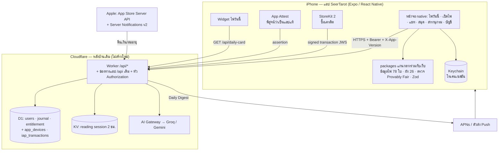

# 📱 แผนออกแบบระบบ — แอป SeerTarot บน iPhone (iOS App Store)

> **สถานะ**: 🚧 ทำแล้วบางส่วน — หลังบ้านข้อ 0.1–0.2 (Bearer token) + `/api/config/app` เสร็จ · แอป Expo MVP อยู่ที่ `mobile/` (5 แท็บ · พิธีเปิดไพ่ 5 ขั้น · Provably Fair ในเครื่อง · สารานุกรมออฟไลน์) ผ่าน typecheck/jest/บันเดิล iOS · ยังไม่ทดสอบบนเครื่องจริง · ⏸️ รอบัญชี Apple Developer สำหรับข้อ 0.3–0.4 · Sign in with Apple · IAP · Push · Widget · TestFlight · **ตรวจล่าสุด**: 2026-09-29
> **อ่านก่อนแตะ**: งานแอปมือถือ / API ที่แอปเรียก — ด่าน Origin 33 เส้นกันแอปไว้ + กฎ Apple 4 ข้อที่ทำให้โดนปฏิเสธ

> **ผู้จัดทำ**: Claude · 2026-09-29 · **ฐานที่ตรวจ**: `main` ที่ `8d77fda` (หลัง PR #632)
> **ขอบเขต**: ออกแบบระบบ + ลำดับงาน — **ยังไม่มีโค้ดแอปสักบรรทัด** เลขไฟล์/บรรทัดที่อ้างคือของจริง ณ commit ข้างบน
> **หลักการใหญ่**: แอปคือ "หน้าร้านใหม่" ของหลังบ้านเดิม — **ใช้ Worker · D1 · KV · AI · Provably Fair ชุดเดียวกับเว็บ** ไม่สร้างหลังบ้านใหม่

---

## 0. สรุปหนึ่งหน้า (อ่านแค่นี้ก็ตัดสินใจได้)

| คำถาม | คำตอบที่แนะนำ |
| :--- | :--- |
| สร้างด้วยอะไร | **Expo (React Native) + TypeScript** — ใช้โค้ดแกนกลาง (`src/data`, `src/lib/tarot`, schema Zod) ร่วมกับเว็บได้ · ทีมเขียน React อยู่แล้ว · ได้ Android แทบฟรีในอนาคต |
| ทำไมไม่ห่อเว็บ (WebView/Capacitor) | Apple ข้อ **4.2** (แอปที่เป็นแค่เว็บห่อ) + **4.3(b)** (หมวด "ดูดวง" อิ่มตัว ต้องเป็นประสบการณ์คุณภาพสูงเฉพาะตัว) = เสี่ยงโดนปฏิเสธสูงสุด · การ์ด 3D บนเว็บวิวบนมือถือยังไม่ลื่นเท่า native |
| หลังบ้านต้องแก้อะไร | 5 ก้อน: **ช่องทางแอป (Bearer token + App Attest)** · **Sign in with Apple** · **ซื้อเครดิตผ่าน StoreKit (IAP)** · **Push แจ้งเตือน** · **Universal Links** (หัวข้อ 4) |
| เงิน | เครดิตเปิดไพ่ (`pack_3/10/30`) **ต้องขายผ่าน In-App Purchase** ในแอป (ข้อ 3.1.1) · ระบบ Omise ของเว็บใช้ในแอปไม่ได้ |
| ใช้เวลา | เฟส 0–2 ≈ **9–12 สัปดาห์** ถึงขึ้น App Store เวอร์ชัน 1.0 (หัวข้อ 7) |
| ต้นทุนคงที่ | Apple Developer Program **99 USD/ปี** · EAS Build (สร้างไฟล์แอปบนคลาวด์ ไม่ต้องมี Mac) มีแผนฟรี · Apple หักค่าธรรมเนียม IAP **15%** (Small Business Program) |
| เจ้าของต้องทำ | เปิดบัญชี Apple Developer + สัญญา Paid Apps/บัญชีธนาคาร/ภาษี · เคาะราคา IAP · ตอบคำถามหัวข้อ 9 |

---

## 1. สิ่งที่มีอยู่แล้ว (ตรวจกับโค้ดจริง ไม่ใช่เอกสาร)

| ชิ้นส่วน | ที่อยู่ในโค้ด | แอปใช้ได้เลยไหม |
| :--- | :--- | :--- |
| API เปิดไพ่ start → shuffle → read (SSE) → chat | `src/app/api/reading/*` | ✅ ใช้ได้ **หลังแก้ด่าน Origin** (หัวข้อ 4.1) |
| ไพ่ประจำวัน / ราศี | `src/app/api/daily-card/*` | ✅ GET ผ่านด่านได้อยู่แล้ว |
| สมุดบันทึก / สรุปรายเดือน | `src/app/api/journal/*` | ✅ หลังแก้ด่าน Origin + auth |
| สิทธิ์/โควตา/แลกรหัส | `src/app/api/entitlement/*` · `src/lib/entitlement/*` | ⚠️ ผู้เยี่ยมชมผูกกับคุกกี้ `tarot_guest` (`guest.ts`) · รหัสแลกสิทธิ์ขัดกฎ Apple (หัวข้อ 5) |
| ล็อกอิน Google / LINE / อีเมล | `src/app/api/auth/*` | ⚠️ ทั้งหมดส่งคุกกี้ httpOnly `tarot_auth_session` (`session.ts`) · อีเมลใช้ Turnstile |
| ลบบัญชี | `DELETE /api/account` (`src/app/api/account/route.ts:11`) | ✅ ตรงข้อ 5.1.1(v) ของ Apple — แค่ต้องมีปุ่มในแอป |
| ส่งออกข้อมูล | `src/app/api/account/export` | ✅ |
| ซื้อเครดิต | `entitlement/checkout` → Omise (`src/lib/marketplace/payment-gateway.ts`) | ❌ ห้ามใช้ในแอป iOS |
| Daily Digest | `src/app/api/cron/daily-digest` (ส่งอีเมล) | ➕ เพิ่มช่อง Push |
| PWA | `src/app/manifest.ts` · `public/sw.js` | ใช้ต่อบนเว็บ ไม่เกี่ยวกับแอป |
| ภาพไพ่ 1909 | `public/cards/` — `w256` 2.9 MB · `w512b` 7.2 MB · `w768b` 11 MB | ✅ ฝังในแอปได้ (หัวข้อ 3.4) |

**ด่านที่แอปจะชนทันที**: `isRequestAuthorizedOrigin()` (`src/lib/security/anti-theft.ts`) อยู่ใน **33 route** — แอป native ไม่ส่ง `Origin` / `Sec-Fetch-Site` → ทุก POST ได้ **403** ทันที

---

## 2. สถาปัตยกรรมภาพรวม



หลักการ:
1. **เซิร์ฟเวอร์ยังเป็นผู้สับไพ่เสมอ** — แอปส่ง `clientSeed` + `pickedIndices` แบบเดียวกับเว็บ แล้ว **ตรวจ commitment ซ้ำในเครื่อง** (กฎเหล็ก 14 · Provably Fair)
2. **API ชุดเดียว สองช่องทาง** — เว็บใช้คุกกี้ แอปใช้ `Authorization: Bearer` · ห้ามแยก route `/api/app/*` ซ้ำ (โค้ดสองชุด = บั๊กสองเท่า)
3. **ข้อมูลคงที่อยู่ในแอป** (ไพ่ 78 ใบ · ความหมาย · ผัง · ภาพ) — เปิดสารานุกรมได้แม้ออฟไลน์ ลดคำขอเข้า Worker

---

## 3. ฝั่งแอป (Client)

### 3.1 เลือกเทคโนโลยี — เทียบ 3 ทาง

| | **Expo / React Native** ✦ แนะนำ | Capacitor (ห่อเว็บ) | SwiftUI ล้วน |
| :--- | :--- | :--- | :--- |
| ใช้โค้ดเว็บซ้ำ | แกน TS ใช้ร่วมได้ · UI เขียนใหม่ | ใช้ UI เว็บทั้งหมด | ไม่ได้เลย |
| ความลื่นการ์ด 3D / พลิกไพ่ | 60–120fps ด้วย Reanimated | ขึ้นกับ WebView | ดีที่สุด |
| ความเสี่ยงโดนปฏิเสธ (4.2 / 4.3) | ต่ำ | **สูง** | ต่ำ |
| Widget / Push / StoreKit / Sign in with Apple | มีโมดูลครบ (Widget ใช้ target Swift เล็ก ๆ) | มีปลั๊กอิน | native |
| ต้องมี Mac | ไม่ต้อง (EAS Build บนคลาวด์) | ต้อง | ต้อง |
| AI agent ในทีมเขียนได้ | ✅ React/TS ที่คุ้นอยู่แล้ว | ✅ | ⚠️ ต้องรู้ Swift |
| Android ในอนาคต | แทบฟรี | ฟรี | เขียนใหม่ |

### 3.2 ตำแหน่งโค้ดใน repo

```text
mobile/                        # แอป Expo (โปรเจกต์ใหม่ แยก package.json)
├── app/                       # expo-router: (tabs)/today · read · journal · cards · account
├── components/                # TarotCardNative (พลิก 3D) · CardFan · StreamText · GlassSurface
├── lib/api/                   # client เรียก Worker — ใส่ Bearer · X-App-Version · App Attest
├── lib/auth/                  # Keychain (expo-secure-store) · Sign in with Apple · ASWebAuthenticationSession
├── lib/iap/                   # StoreKit 2
├── targets/widget/            # WidgetKit (Swift) — ไพ่วันนี้
└── assets/cards/              # สำเนาภาพไพ่ที่สร้างจาก scripts (ห้ามคัดลอกมือ)
```

- **ใช้โค้ดแกนกลางร่วม**: ให้ Metro อ่าน `src/data/cards`, `src/data/spreads.ts`, `src/lib/tarot/*` (เฉพาะไฟล์ที่ไม่แตะ DOM/Next) ผ่าน `watchFolders` + alias `@core/*` — **ห้ามคัดลอกข้อมูลไพ่ไปไว้ในแอป** (ความหมาย 780 ข้อความต้องมีแหล่งความจริงเดียว)
- ต้องไม่ทำให้บันเดิลเว็บ/ด่าน `test-bundle-budget` เปลี่ยน · `mobile/` ไม่อยู่ใน `tsconfig.json` ของเว็บ (มี tsconfig ของตัวเอง) · เพิ่ม `mobile/` ใน `knip.jsonc` ignore
- ถ้าไฟล์แกนไหน import ของเว็บ (เช่น `next/*`, `window`) → แยกฟังก์ชันบริสุทธิ์ออกมาก่อนในเฟส 0 (ทำใน PR เว็บ พร้อมด่าน parity เดิม)

### 3.3 หน้าจอ (แท็บล่าง 5 แท็บ)

| แท็บ | สิ่งที่มี | API |
| :--- | :--- | :--- |
| **วันนี้** | ไพ่ประจำวัน (แตะพลิกเอง) · ราศี · streak · ทำนายด่วน 1 ใบ | `daily-card` · `daily/checkin` · `reading/*` |
| **เปิดไพ่** | เลือกผัง 26 แบบตามหมวด (`spread-categories.ts`) → ตั้งคำถาม → เลือกแม่หมอ 5 บุคลิก → สับ → แผ่ไพ่ 78 ใบเลือกเอง → พลิกเอง → คำอ่านสตรีม → ถามต่อ → ตราตรวจ Provably Fair | `reading/start` · `shuffle` · `read` · `chat` · `clarify` |
| **สมุด** | ประวัติคำทำนาย · สรุปรายเดือน · ซิงก์คลาวด์ | `journal/*` |
| **สารานุกรม** | ไพ่ 78 ใบ + 5 มิติความหมาย + ค้นหา — **ทำงานออฟไลน์** | ข้อมูลในแอป · `search` (ออนไลน์) |
| **บัญชี** | ล็อกอิน · โควตา · ซื้อเครดิต (IAP) · ตั้งค่าแจ้งเตือน · ส่งออกข้อมูล · **ลบบัญชี** · นโยบาย | `auth/*` · `entitlement` · `account/*` |

**กฎเหล็กของเว็บที่แอปต้องถือเหมือนกัน** (ด่าน CI ของแอปต้องตรวจ — หัวข้อ 8):
- ไพ่คว่ำเสมอ ผู้ใช้แตะพลิกเอง (กฎ 4) · ภาพ 1909 Rider-Waite เท่านั้น (กฎ 5) · มีคอมโพเนนต์ภาพไพ่จุดเดียว `CardImageNative` (เทียบกฎ 8)
- ห้ามอิโมจิการ์ตูน ใช้ `✦` `✨` เท่านั้น (กฎ 2) · ผัง ≥ 7 ใบ จัด 2 ชั้น (กฎ 9) · Zero-Clipping (กฎ 3)
- คำถามเสี่ยงทำร้ายตัวเอง → แสดงสายด่วน **1323** + ปุ่มโทรออก `tel:1323` (กฎ 6 — ในแอปกดโทรได้ทันที ดีกว่าเว็บ)
- **ห้ามกุไพ่** — ข้อมูลไพ่หาย/สตรีมขาด = แสดง "โหลดใหม่อีกครั้ง" เท่านั้น (กฎ 14)

### 3.4 ภาพไพ่และขนาดแอป

- ฝัง `w256` (2.9 MB, ใช้ในกริด/พัด) + `w512b` (7.2 MB, ใช้ตอนพลิก/ขยาย) = **~10 MB** · ไม่ฝัง `w768b` (โหลดจาก CDN เมื่อซูมเต็มจอ)
- สร้างชุดภาพแอปด้วยสคริปต์ต่อจาก `npm run cards:variants` — **ห้ามคัดลอกมือ** · ด่านตรวจว่าครบ 78 ใบและตรงต้นฉบับ (แฮช)

### 3.5 เรื่องเทคนิคที่ต้องรู้ก่อนลงมือ

| เรื่อง | ทางแก้ |
| :--- | :--- |
| **สตรีม SSE** — `fetch` เดิมของ React Native อ่านสตรีมไม่ได้ | ใช้ `expo/fetch` (รองรับ `ReadableStream`) · ทดสอบกับ `/read` จริงตั้งแต่สัปดาห์แรก |
| **ตรวจ Provably Fair ในเครื่อง** — เว็บใช้ `crypto.subtle` | ใช้ `expo-crypto` (SHA-256) + ฟังก์ชันสับไพ่ตัวเดียวกับเว็บ · เพิ่มแอปเข้า `verify:parity` |
| **ธีมกระจกอุ่น** — เว็บห้าม `backdrop-filter` (INC-0056) | ข้อห้ามนั้นเป็นเรื่องประสิทธิภาพเบราว์เซอร์ · บน iOS ใช้เบลอของระบบ (`expo-blur` / วัสดุ Liquid Glass ของ iOS 26) ได้ · ดึงโทเคนสีจาก `globals.css` ไปเป็นไฟล์ theme ของแอปด้วยสคริปต์ |
| **เสียงพากย์ TTS** | `expo-speech` เสียงไทยของระบบ |
| **สั่นตอบสนอง** | `expo-haptics` ตอนพลิกไพ่ — จุดขายที่เว็บทำไม่ได้ |
| **ภาษา** | ไทย/อังกฤษ ตามภาษาเครื่อง · ใช้พจนานุกรม i18n ชุดเดียวกับเว็บ |

---

## 4. ฝั่งหลังบ้าน — สิ่งที่ต้องเพิ่ม/แก้ (ทำในเฟส 0 ได้เลย ไม่กระทบเว็บ)

### 4.1 ช่องทางแอป: Bearer token แทนคุกกี้

**ปัญหา**: ทุก route อ่านเซสชันผ่าน `cookies()` ใน `getSessionUser()` (`src/lib/auth/session.ts`) และกันด้วย `isRequestAuthorizedOrigin()` 33 จุด

**ทางแก้** (ไฟล์เดียวต่อเรื่อง ไม่ไล่แก้ 33 route):
1. `getSessionUser()` — ถ้ามี `Authorization: Bearer <token>` ให้ตรวจโทเคน HMAC ตัวเดียวกับคุกกี้ (`verifyUserSession`) **พร้อมตรวจ `token_version` เหมือนเดิม** · ไม่มีหัวนี้ = ทำงานแบบเดิมทุกประการ
2. `isRequestAuthorizedOrigin()` — ยอมให้ผ่านเมื่อคำขอมี Bearer ที่ถูกต้อง **หรือ** มี App Attest assertion ที่ถูกต้อง
   - เหตุผลทางความปลอดภัย: ด่านนี้กัน **CSRF** ซึ่งเกิดจากเบราว์เซอร์แนบคุกกี้ให้อัตโนมัติ · Bearer ไม่ถูกแนบอัตโนมัติ → CSRF ไม่มีผล
   - ⚠️ ตามคำเตือนหัวไฟล์ `anti-theft.ts` (บทเรียน T-14): ด่านนี้**ไม่ใช่ด่านกันบอท** · ปลายทางที่เสียเงิน (เรียก AI) ยังต้องผ่าน `consumeEdgeRateLimits` + `ai-budget.ts` + โควตาต่อผู้ใช้ **เหมือนเดิมทุกชั้น**
3. ล็อกอินจากแอปคืนโทเคนใน body (ไม่ใช่ Set-Cookie) เมื่อคำขอมีหัว `X-Client: ios` · แอปเก็บใน Keychain · อายุเท่าคุกกี้ (30 วัน) + ต่ออายุเงียบเมื่อเหลือ < 7 วัน
4. ออกจากระบบ / เปลี่ยนรหัสผ่าน → `token_version` +1 เหมือนเดิม → โทเคนในแอปใช้ไม่ได้ทันที

### 4.2 กันแอปปลอม/บอท: App Attest (+ DeviceCheck)

- **App Attest** (Apple): พิสูจน์ว่าคำขอมาจากแอปแท้บนเครื่องจริง · ใช้แทน Turnstile ตอนสมัคร/ล็อกอินอีเมล และกับคำขอของผู้เยี่ยมชมที่ยังไม่ล็อกอิน
- **สิทธิ์ฟรีของผู้เยี่ยมชม** (ตอนนี้ผูกคุกกี้ `tarot_guest` ซึ่ง "ล้างคุกกี้ = สิทธิ์ใหม่"): ในแอปใช้ **DeviceCheck 2 บิต** ที่ Apple เก็บให้ต่อเครื่อง — ลบแอปติดตั้งใหม่ก็ยังจำได้ → **กันโกงสิทธิ์ฟรีได้ดีกว่าเว็บ** (อัปเดต `docs/specs/ENTITLEMENT_ABUSE_MODEL.md`)
- ตาราง D1 ใหม่ `app_devices` (`key_id` · `public_key` · `counter` · `user_id?` · `created_at`) — migration `0019`

### 4.3 Sign in with Apple (บังคับ)

- Apple ข้อ **4.8**: แอปที่มีล็อกอิน Google/LINE **ต้องมีตัวเลือกล็อกอินที่ปกป้องความเป็นส่วนตัว** — ทางที่ตรงที่สุดคือ Sign in with Apple
- เพิ่ม provider `apple` ใน `src/app/api/auth/[provider]` + ผูกใน `oauth_identities` แบบเดียวกับ Google/LINE (ตรงอีเมล = เชื่อมบัญชีเดิม)
- ⚠️ ผู้ใช้เลือก "ซ่อนอีเมล" ได้ (อีเมล `@privaterelay.appleid.com`) → เชื่อมบัญชีเดิมไม่ได้อัตโนมัติ · Daily Digest ทางอีเมลต้องลงทะเบียนโดเมนส่งเมลกับ Apple ก่อน
- ในแอป: ปุ่ม Apple ใช้ `expo-apple-authentication` (native) · Google/LINE ใช้ `ASWebAuthenticationSession` เรียก route OAuth เดิม แล้ว callback กลับแอปผ่าน Universal Link พร้อมโทเคน (state กัน CSRF ย้ายจากคุกกี้ไปเก็บใน KV อายุ 10 นาที)
- ลบบัญชีที่ล็อกอินด้วย Apple → ต้องเรียก Apple revoke token ด้วย (ข้อกำหนด Apple)

### 4.4 ซื้อเครดิตด้วย In-App Purchase (StoreKit 2)

- สร้างสินค้า **Consumable** 3 ตัวใน App Store Connect ตรงกับ `CREDIT_PACKAGES` (`src/lib/entitlement/packages.ts`)
- ขั้นตอน: แอปซื้อ → ได้ signed transaction (JWS) → `POST /api/entitlement/iap` → Worker **ตรวจลายเซ็นกับใบรับรอง Apple** + กันใช้ซ้ำด้วย `transactionId` (unique) → เติมเครดิตด้วยฟังก์ชันเดิมใน `purchase.ts` → แอปเรียก `finish()`
- **App Store Server Notifications v2** → `POST /api/entitlement/iap/notify` · รับ `REFUND` → หักเครดิตคืน · กรณีใช้เครดิตไปแล้วจะให้ติดลบหรือปิดสิทธิ์ซื้อ ต้องให้เจ้าของเคาะ
- ตาราง D1 ใหม่ `iap_transactions` (`transaction_id` PK · `user_id` · `product_id` · `credits` · `environment` sandbox/production · `revoked_at`)
- ซื้อได้เฉพาะผู้ล็อกอิน (เหมือนเว็บ) · ปุ่ม "กู้คืนการซื้อ" ไม่จำเป็นสำหรับ consumable แต่ต้องซิงก์เครดิตจากบัญชี

### 4.5 Push แจ้งเตือน (ไพ่วันนี้ / Daily Digest)

- ตาราง D1 `push_devices` (`user_id?` · `token` · `locale` · `tz` · `enabled` · `last_seen`) + `POST/DELETE /api/push/devices`
- cron `daily-digest` ส่งได้ 2 ช่อง: อีเมล (เดิม) + push (ใหม่) ตามค่าผู้ใช้ (`users.digest_email` เดิม + คอลัมน์ `digest_push` ใหม่ · กันส่งซ้ำด้วย `digest_log` เดิม)
- ⚠️ **ต้องทดสอบก่อนเลือก**: APNs รับเฉพาะ HTTP/2 — ถ้า `fetch` ของ Worker ต่อ APNs ตรงไม่ได้ ให้ส่งผ่าน **Expo Push API** หรือ FCM HTTP v1 (รับ HTTP/1.1 แล้วส่งต่อ APNs ให้) · ทำ spike 1 วันในเฟส 0
- ขอสิทธิ์แจ้งเตือน **หลังผู้ใช้เปิดไพ่ใบแรกเสร็จ** ไม่ใช่ตอนเปิดแอปครั้งแรก (อัตรายอมรับสูงกว่า)

### 4.6 Universal Links + เวอร์ชันแอป

- `public/.well-known/apple-app-site-association` (JSON ไม่มีนามสกุล · ต้องตั้ง `Content-Type: application/json` ใน `public/_headers`) → ลิงก์ `/cards/*`, `/spreads/*`, `/s/<id>` (ลิงก์แชร์คำทำนาย) เปิดในแอปถ้าติดตั้งไว้
- ทุกคำขอจากแอปส่ง `X-App-Version` · `GET /api/config/app` คืน `minVersion` / `latestVersion` → บังคับอัปเดตเมื่อ API เปลี่ยนแบบเข้ากันไม่ได้
- **กติกาใหม่ของ API**: แอปเวอร์ชันเก่าอยู่ในมือผู้ใช้หลายเดือน → ห้ามลบ/เปลี่ยนชื่อฟิลด์ใน response ของ route ที่แอปใช้ (เพิ่มได้อย่างเดียว) · ทำ schema Zod ของ response เป็น contract ร่วม + ด่าน CI

---

## 5. กฎ App Store ที่ต้องผ่าน (จุดที่โดนปฏิเสธบ่อย)

| ข้อ | ความเสี่ยงกับเรา | ทางผ่าน |
| :--- | :--- | :--- |
| **4.3(b) Spam** — Apple ระบุ "fortune telling" ตรง ๆ ว่าหมวดอิ่มตัว จะปฏิเสธถ้าไม่ใช่ประสบการณ์คุณภาพสูงเฉพาะตัว | **สูงสุด** | จุดต่างที่ต้องโชว์ในภาพหน้าร้าน + โน้ตถึงผู้ตรวจ: สับไพ่พิสูจน์ได้ (Provably Fair) · เลือก/พลิกไพ่เองแบบ 3D · แม่หมอ 5 บุคลิก + ถามต่อ · สมุดบันทึก · สารานุกรม 78 ใบออฟไลน์ · Widget |
| **4.2** แอปเป็นแค่เว็บห่อ | สูง ถ้าใช้ WebView | ทำ native (Expo) · ใช้ความสามารถเครื่อง: Widget · Push · Haptics · Keychain |
| **3.1.1** ของดิจิทัลต้องขายผ่าน IAP | สูง | เครดิตขายผ่าน IAP เท่านั้น · **ห้ามมีลิงก์/ข้อความชวนไปซื้อบนเว็บ** ในแอป (ยกเว้น storefront สหรัฐฯ ที่เปิดให้ลิงก์ได้แล้ว — ไม่ต้องทำในเวอร์ชันแรก) · เครดิตที่ซื้อจากเว็บใช้ในแอปได้ (3.1.3(b)) เพราะในแอปก็มีขายผ่าน IAP ด้วย |
| **3.1.1** ห้ามปลดล็อกด้วยรหัสของเราเอง | กลาง | **ซ่อนช่องแลกรหัส `SEER-XXXX-XXXX` ในแอป** · ถ้าอยากแจกโค้ด ใช้ Offer Codes ของ Apple แทน |
| **4.8** Sign in with Apple | บังคับ | หัวข้อ 4.3 |
| **5.1.1(v)** ลบบัญชีในแอป | บังคับ | ปุ่มในแท็บบัญชี → `DELETE /api/account` (มีแล้ว) |
| **5.1.1 / 5.1.2** ความเป็นส่วนตัว | กลาง | Privacy Nutrition Label · ไฟล์ `PrivacyInfo.xcprivacy` · **ไม่ใช้ตัวติดตามข้ามแอป** (ไม่ต้องขอ ATT) — วิเคราะห์ด้วย `/api/stats/event` ของเราเอง ไม่ใส่ GA4 ในแอป |
| **1.4.1** สุขภาพ | ต่ำ | ข้อความ "เพื่อความบันเทิงและทบทวนตนเอง" + 1323 เมื่อพบสัญญาณเสี่ยง (มีแล้วที่ `src/lib/safety`) |
| **1.2** เนื้อหาที่ AI สร้าง/แชท | กลาง | ปุ่ม "รายงานคำตอบนี้" ในหน้าคำอ่าน/แชท → `/api/feedback` (มีแล้ว) · ตัวกรองความปลอดภัยเดิมทำงานฝั่ง Worker อยู่แล้ว |
| Marketplace แม่หมอตัวจริง | — | **ไม่ใส่ในเวอร์ชัน 1.0** · เฟสหลังค่อยพิจารณาข้อ 3.1.3(d) (บริการตัวต่อตัวแบบเรียลไทม์จ่ายนอก IAP ได้) |

---

## 6. ความปลอดภัยและข้อมูล (สรุป)

- โทเคนเก็บใน **Keychain** เท่านั้น (ห้าม AsyncStorage) · ล็อกหน้าจอสมุดด้วย Face ID เป็นตัวเลือก
- HTTPS อย่างเดียว (ATS ค่าเริ่มต้น) · ไม่ต้องทำ certificate pinning ในเวอร์ชันแรก (Cloudflare หมุนใบรับรองเอง — pin แล้วแอปพังทั้งหมดได้)
- ไม่มีความลับฝั่งแอป: คีย์ AI · `AUTH_SECRET` · คีย์ Apple (`.p8`) อยู่ใน Worker secrets เท่านั้น — เพิ่มรายการลง `docs/PENDING_SETUP.md`
  - `APPLE_TEAM_ID` · `APPLE_BUNDLE_ID` · `APPLE_SIGNIN_KEY_ID` + `APPLE_SIGNIN_PRIVATE_KEY` · `APPLE_IAP_ISSUER_ID` + `APPLE_IAP_KEY_ID` + `APPLE_IAP_PRIVATE_KEY` · `PUSH_*` ตามตัวส่งที่เลือก
- เพดานถี่/งบ AI: คำขอจากแอปนับรวมใน `edge_rate_buckets` และ `ai-budget.ts` เหมือนเว็บ (คีย์ตาม user id หรือ App Attest key id แทน IP — มือถือหลายเครื่องแชร์ IP ผู้ให้บริการได้)
- PDPA: หน้า `/privacy` เพิ่มหัวข้อข้อมูลจากแอป (push token · device id ของ App Attest/DeviceCheck)

---

## 7. ลำดับงาน (เฟส) — PR เล็ก แยกกัน ตามกฎ One Branch per Milestone

### เฟส 0 — วางรากหลังบ้าน (2–3 สัปดาห์ · ทำได้ทันทีโดยไม่กระทบเว็บ)

| # | งาน | ไฟล์หลัก | ตรวจอย่างไร |
| :-: | :--- | :--- | :--- |
| 0.1 | Bearer token ใน `getSessionUser()` + ด่าน Origin ยอม Bearer | `src/lib/auth/session.ts` · `src/lib/security/anti-theft.ts` | สคริปต์ QA ใหม่: ยิงทุก route ด้วย Bearer ✓ / ไม่มีหัว = พฤติกรรมเดิม / โทเคนหลังเปลี่ยนรหัส = 401 |
| 0.2 | ล็อกอินคืนโทเคนเมื่อ `X-Client: ios` · OAuth state ย้ายไป KV | `src/app/api/auth/*` | ด่าน `test-email-auth` (`scripts/qa/test-email-auth.ts`) เดิมต้องผ่าน + เคสแอป |
| 0.3 | Sign in with Apple (เว็บได้ใช้ด้วย) | `src/app/api/auth/[provider]` · migration | ทดสอบกับบัญชี sandbox |
| 0.4 | `app_devices` + App Attest verify | migration `0019` · `src/lib/security/app-attest.ts` | unit test กับเวกเตอร์ของ Apple |
| 0.5 | แยกแกน TS บริสุทธิ์ที่แอปต้องใช้ (ไม่มี `next/*`/DOM) | `src/lib/tarot/*` · `src/data/*` | `verify:parity` · `verify:cards` ผ่าน · บันเดิลเว็บไม่เปลี่ยน |
| 0.6 | spike 1 วัน: Push จาก Worker (APNs ตรง vs Expo Push) + SSE ผ่าน `expo/fetch` | — | บันทึกผลลงแผนนี้ |
| 0.7 | `/.well-known/apple-app-site-association` + `/api/config/app` | `public/` · `src/app/api/config` | curl ดู content-type |

### เฟส 1 — แอป MVP บน TestFlight (4–5 สัปดาห์)

- โครง Expo + expo-router + ธีมจากโทเคนเว็บ + 5 แท็บ
- เปิดไพ่ครบวงจร (ผังทั้ง 26 · พัด 78 ใบ · พลิก 3D + haptics · สตรีมคำอ่าน · ถามต่อ · ตรวจ Provably Fair ในเครื่อง)
- ไพ่วันนี้ · สารานุกรมออฟไลน์ · สมุดบันทึก · ล็อกอิน 4 ทาง · ลบบัญชี
- **ยังไม่ขายของ** — โควตาฟรีอย่างเดียว · แจก TestFlight ให้คนใกล้ตัว 20–50 คน เก็บ crash (Sentry หรือ `expo-updates` + Crashlytics) และความเห็น

### เฟส 2 — พร้อมขึ้น App Store 1.0 (3–4 สัปดาห์)

- IAP 3 แพ็กเกจ + ตรวจฝั่ง Worker + Server Notifications (คืนเงิน)
- Push ไพ่วันนี้ + ตั้งเวลาแจ้งเตือนตามเขตเวลา
- Widget ไพ่วันนี้ (หน้าจอหลัก + หน้าล็อก)
- หน้าร้าน: ภาพหน้าจอ 6.9" + 6.5" สองภาษา · คำอธิบาย/คีย์เวิร์ดไทย (ใช้ข้อมูลคำค้นจาก GSC ที่มีแล้ว) · โน้ตถึงผู้ตรวจ + บัญชีทดสอบ · Privacy Label · อายุผู้ใช้ (age rating)
- ส่งตรวจ — **เผื่อโดนปฏิเสธ 1–2 รอบ** (โดยเฉพาะ 4.3)

### เฟส 3 — หลังเปิดตัว (ทำตามผลจริง)

- Live Activity / Dynamic Island ระหว่างรอคำอ่าน · App Intents ("หยิบไพ่วันนี้" ผ่าน Siri/Shortcuts)
- iPad layout · Android (Expo build เดิม) · Marketplace แม่หมอตัวจริงในแอป
- OTA update ด้วย `expo-updates` สำหรับแก้ JS เล็ก ๆ (ห้ามใช้เปลี่ยนฟีเจอร์หลักเลี่ยงการตรวจ — ผิดข้อ 2.5.2)

---

## 8. CI / ด่านตรวจของแอป

- workflow ใหม่ `mobile.yml` รันเฉพาะเมื่อ `mobile/**` หรือไฟล์แกนร่วมเปลี่ยน: typecheck · eslint · jest · `expo-doctor`
- ด่านใหม่ใน `repo:verify` (นับเข้าจำนวนด่านใน `CHECKS` แล้วอัปเดตเลขในเอกสารด้วย `test-docs-numbers`):
  1. **API contract** — response ของ route ที่แอปใช้ต้องผ่าน schema Zod ร่วม (กันเว็บเปลี่ยนฟิลด์แล้วแอปเก่าพัง)
  2. **Provably Fair parity แอป = เว็บ** (ต่อยอด `verify:parity`)
  3. **ภาพไพ่ในแอปครบ 78 ใบและตรงต้นฉบับ**
  4. **ไม่มีอิโมจิการ์ตูน / ไม่มี fallback ไพ่ปลอม** ในโค้ดแอป (สแกนแบบเดียวกับเว็บ)
- สร้างไฟล์แอปด้วย **EAS Build** · ส่ง TestFlight ด้วย **EAS Submit** (ไม่ต้องมี Mac)

---

## 9. สิ่งที่เจ้าของต้องตัดสินใจ/ทำ (⏸️ เริ่มเฟส 0 ข้อ 0.3–0.4 ไม่ได้จนกว่าจะได้ข้อ 1)

| # | เรื่อง | ตัวเลือก / ข้อแนะนำ |
| :-: | :--- | :--- |
| 1 | **เปิดบัญชี Apple Developer Program** (99 USD/ปี) | บุคคลธรรมดา = เร็ว แต่ชื่อผู้ขายบน App Store เป็นชื่อจริง · นิติบุคคล = ชื่อ "SeerTarot"/บริษัท ต้องมีเลข D-U-N-S (รอ 1–2 สัปดาห์) · แนะนำ **นิติบุคคล** ถ้ามีบริษัทอยู่แล้ว |
| 2 | ยืนยันแนวทาง **Expo / React Native** | แนะนำ (หัวข้อ 3.1) |
| 3 | ราคา IAP | Apple หัก 15% → คงราคา 59/149/299 บาท (รับน้อยลง) หรือตั้งราคาแอปสูงกว่าเว็บเล็กน้อย · **ห้ามบอกในแอปว่าบนเว็บถูกกว่า** |
| 4 | สมัคร **App Store Small Business Program** (ค่าธรรมเนียม 15% แทน 30%) + สัญญา Paid Apps + บัญชีธนาคาร/ภาษีใน App Store Connect | ต้องทำก่อนเฟส 2 |
| 5 | ชื่อแอป/ไอคอน/Bundle ID | เสนอ `net.seertarot.app` · ชื่อ "SeerTarot ดูดวงไพ่ทาโรต์" (ไม่เกิน 30 ตัวอักษร) |

---

## 10. วัดผลอย่างไร (หลังเปิดตัว)

| ตัวชี้วัด | เป้าเริ่มต้น | ดูจากไหน |
| :--- | :--- | :--- |
| Crash-free sessions | ≥ 99.5% | Crash reporter |
| เวลาเปิดแอปถึงเห็นไพ่วันนี้ | ≤ 1.5 วินาที (ไพ่วันนี้แคชไว้ในเครื่อง) | วัดในแอป |
| อัตรากลับมาวันที่ 7 (D7) | สูงกว่าผู้ใช้เว็บที่ล็อกอิน | `/api/stats/event` |
| อัตรายอมรับ Push | ≥ 50% | App Store Connect / ตาราง `push_devices` |
| สัดส่วนรายได้ IAP vs เว็บ | ติดตามรายเดือน | `iap_transactions` vs `payments` |

---

## 11. ความเสี่ยงหลัก

| ความเสี่ยง | ผลกระทบ | ลดความเสี่ยง |
| :--- | :--- | :--- |
| โดนปฏิเสธข้อ 4.3(b) | เลื่อนเปิดตัว | ทำ native เต็มรูป + โชว์จุดต่างใน review notes ตั้งแต่ครั้งแรก · เผื่อเวลา 2 รอบ |
| แก้ `session.ts` / `anti-theft.ts` แล้วเว็บพัง (ล็อกอิน/CSRF) | ผู้ใช้เว็บทั้งหมด | ทางใหม่ทำงาน **เฉพาะเมื่อมีหัว Bearer** · สคริปต์ QA ยิงทั้งสองทาง · PR แยกเล็ก |
| API เปลี่ยนแล้วแอปเก่าพัง | แอปในมือผู้ใช้เสีย | contract test + `minVersion` บังคับอัปเดต |
| ค่าใช้จ่าย AI เพิ่มจากผู้ใช้แอป | งบ AI | เพดานเดิมทุกชั้นใช้กับแอปด้วย · App Attest + DeviceCheck กันสิทธิ์ฟรีซ้ำ |
| ทีมเป็น AI agent หลายตัวแก้พร้อมกัน | ไฟล์ชน | `agent:lock --domain mobile` · งานเฟส 0 แตะไฟล์ auth/security ที่ใช้ร่วม ต้องล็อกก่อนเสมอ |
