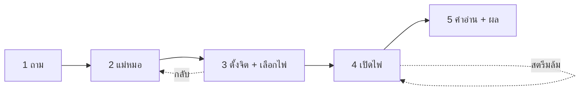

# 🎨 ดีไซน์แอป SeerTarot (iOS) — Workflow · UI · UX

> ฉบับรอบ 3 (2026-09-29) · ต่อยอดจากแผน [`IOS_APP_PLAN`](../docs/plans/IOS_APP_PLAN_2026-09-29.md)
> เป้าหมาย: แอปที่ให้ความรู้สึก "พิธีเปิดไพ่" ไม่ใช่ฟอร์ม — และเป็นจุดต่างที่ตอบข้อ 4.3(b) ของ Apple ได้ตรงตัว

## 0. เปลี่ยนอะไรจากรอบ 2 และทำไม

| ปัญหาของรอบ 2 | รอบ 3 แก้อย่างไร |
| :-- | :-- |
| กระจกทุกกล่อง (การ์ด ชิป ปุ่ม ช่องพิมพ์) — ขัดหลัก Liquid Glass ของ Apple ที่ให้กระจกเป็นของ **ชั้นนำทาง** เท่านั้น · อ่านยากและกินเครื่อง (BlurView หลายสิบชิ้นต่อจอ) | กระจกเหลือแค่ แท็บบาร์ · แถบหัวจอ · ปุ่มกลม · แผงปุ่มล่าง · ปุ่มหลัก — เนื้อหาใช้ `Card` พื้นกระดาษอุ่นเกือบทึบ |
| ทุกอย่างสีครีมเท่ากันหมด ไม่มีจุดเน้น สายตาไม่รู้จะเริ่มที่ไหน | **แผงฟ้าค่ำ** (`NightPanel`) หนึ่งจุดต่อหน้า: ไพ่ประจำวัน · สรุปคำแนะนำ · หัวหน้าไพ่ — ความต่างมืด/สว่างดึงสายตา |
| ปุ่มทองไล่เฉดดูเป็นสีน้ำตาลเก่า | ปุ่มหลักกลางวัน = **แคปซูลหมึกค่ำ** ตัวครีม ไอคอนทอง · กลางคืน = ทองตัวเข้ม |
| หัวข้อใช้ฟอนต์ระบบตัวหนา ไม่มีบุคลิก | หัวข้อใช้ **Noto Serif Thai** ตัวเดียวกับเว็บ (ฝังในแอป) · เนื้อความยังเป็นฟอนต์ระบบ (อ่านง่ายสุดบน iPhone) |
| 5 แท็บ — "บัญชี" กินที่ทั้งที่ใช้นาน ๆ ครั้ง | **4 แท็บ** · บัญชีเป็นปุ่มรูปคนมุมขวาบนหน้าวันนี้ (แบบ App Store) เปิดเป็นแผ่นเด้ง |
| เลือกแม่หมอด้วยการปัดการ์ดแนวนอน — เห็นทีละ 1–2 ท่าน | รายการแนวตั้งแบบ radio เห็นครบ 5 ท่านในจอเดียว |
| หน้าไพ่เรียง 10 กล่อง (5 หัวข้อ × 2 ทิศ) ยาวมาก | สลับ "หัวตั้ง/กลับหัว" (Segmented) + ชิปหัวข้อ → เห็นทีละกล่องที่ต้องการ |
| ข้อความผิดพลาดดิบ เช่น "Failed to fetch" | `friendlyMessage()` แปลงเป็นภาษาคนทุกจุด + ปุ่ม "โหลดใหม่อีกครั้ง" |
| ชื่อผังซ้ำจำนวนใบ "(ไพ่ 3 ใบ)" ยาวจนตัดบรรทัด | `spreadTitle()` ตัดตอนแสดงผล · จำนวนใบเป็นป้ายแยก |

## 0.1 เรียนจากแอประดับโลกบน Mobbin (รอบ 3.1)

ศึกษาหน้าจอจริงบน [Mobbin](https://mobbin.com) — Co–Star (onboarding 21 หน้า · หน้าวันนี้) · Moonly · Calm · Headspace · หมวด Meditation 36 แอป · Finch · Stoic แล้วเลือกเฉพาะแพทเทิร์นที่เข้ากับแอปดูดวงของเรา

| แพทเทิร์น (แอปต้นแบบ) | นำมาใช้ที่ |
| :-- | :-- |
| หน้าแนะนำ "หนึ่งหน้า หนึ่งประโยคใหญ่ serif + ภาพเดียว" · ปุ่มติดล่าง · ข้ามได้ตลอด (Co–Star) | `app/onboarding.tsx` 3 หน้า (ไพ่ 1909 ของแท้ · เลือกเอง/พลิกเอง/ตรวจได้ · แม่หมอ 5 น้ำเสียง) แสดงครั้งแรกครั้งเดียว (`lib/onboarding.ts`) — ทุกประโยคเป็นข้อเท็จจริงของระบบ |
| ถ้อยคำประจำวันเป็น "พาดหัว" serif ตัวใหญ่ ไม่ใช่ข้อความเล็กในการ์ด (Co–Star "Today at a glance") | ไพ่ประจำวันหลังพลิก: ป้าย "สิ่งที่ไพ่อยากบอกวันนี้" + ข้อความ serif 19pt · ป้ายธาตุประจำวัน (แบบการ์ด "Moon in Pisces" ของ Moonly) |
| คำชวนหายใจเต็มจอ "take a deep breath" (Calm) | ขั้นตั้งจิต: "หายใจเข้า… / หายใจออก…" สลับตามจังหวะดวงแก้ว 2.2 วินาที (ลดการเคลื่อนไหว = ข้อความนิ่ง) |
| แถว "Recent" ให้กลับไปต่อจากครั้งก่อน (Headspace) | หน้าวันนี้: การ์ด "ต่อจากครั้งก่อน" จากสมุดจริง (`/api/journal?limit=1`) เมื่อล็อกอิน · ไม่มีข้อมูล = ไม่แสดง |
| ช่องหมวดมีภาพประกอบประจำหมวด (Calm · Headspace · Insight Timer) | ช่องหัวข้อ 2×2 มีไพ่ 1909 ประจำหัวข้อเอียงมุมขวา (คู่รัก · 8 เหรียญ · เอซเหรียญ · ฤาษี) |

ไม่นำมา: ภาพประกอบการ์ตูน/ตัวละคร (Finch · Headspace) ขัดกฎเหล็กข้อ 2 และ 5 · โทนขาวดำล้วนของ Co–Star ไม่ใช่แบรนด์ธีมอุ่นของเรา · หน้าขออนุญาตแจ้งเตือนก่อนระบบถาม (Co–Star) — เก็บไว้ใช้ตอนทำ Push

## 1. หลักการออกแบบ

| หลัก | ความหมายในแอป |
| :-- | :-- |
| **เนื้อหามาก่อน กระจกลอยเหนือ** | กระจกใช้กับการนำทางเท่านั้น (ข้อ 0) |
| **หนึ่งจุดเน้นต่อหน้า** | แผงฟ้าค่ำ 1 แผ่น + ปุ่มหลัก 1 ปุ่ม ที่เหลือเป็นพื้นสว่าง |
| **มือเดียว** | ปุ่มหลักอยู่แผงลอยล่างจอ · เป้าแตะ ≥ 44pt (ขอบไพ่ในสำรับที่ซ้อนกันกว้าง 44pt พอดี) |
| **รู้ตำแหน่งเสมอ** | แถบ 5 ช่อง ช่องปัจจุบันยาวกว่า (บอกด้วยรูปทรง ไม่ใช่สีอย่างเดียว) · ปิดกลางทางต้องยืนยัน |
| **ผู้ใช้ทำเอง** | เลือกไพ่เอง · พลิกไพ่เอง (กฎเหล็กข้อ 4) — ไม่มีปุ่ม "พลิกทั้งหมด" |
| **ฉากบอกจังหวะ** | ถาม/เลือกแม่หมอ = กลางวัน · ตั้งจิต/เลือก/เปิดไพ่ = **ฉากค่ำ** (เฟดข้าม) · อ่านคำทำนาย = กลางวัน (ตัวหนังสือยาวอ่านบนพื้นสว่างสบายตากว่า) |
| **ให้เห็นความยุติธรรม** | คำมั่นโชว์ใต้สำรับก่อนเลือก · การ์ดผลตรวจ Provably Fair (ผ่าน/ไม่ผ่าน/กำลังตรวจ) หลังคำอ่าน |
| **สงบ ไม่ตกใจ** | เคลื่อนไหวช้า นุ่ม · เคารพ "ลดการเคลื่อนไหว" · ห้ามอิโมจิการ์ตูน (ใช้ ✦ + ไอคอนเส้น Ionicons) |

## 2. โครงการนำทาง

```
Tab Bar กระจกลอย (4) ── วันนี้ · เปิดไพ่ · สมุด · คลังไพ่
   ├─ (ครั้งแรก) ─► [Full-screen] หน้าแนะนำ 3 หน้า
   ├─ วันนี้    → ไพ่ประจำวัน (ฟ้าค่ำ) · ปุ่มถามไพ่ · ต่อจากครั้งก่อน · หัวข้อ 2×2 · ผังยอดนิยม (ปัด) · ทำนายด่วน
   │              └─ ปุ่มรูปคนมุมขวาบน ─► [Sheet] บัญชี
   ├─ เปิดไพ่   → ชิปหมวด (แถวเดียว) · รายการผังพร้อมภาพย่อบนฟ้าค่ำ
   │                     └─► [Full-screen Modal] พิธีเปิดไพ่ 5 ขั้น (ไม่มีแท็บบาร์)
   ├─ สมุด      → ประวัติคำทำนาย · ยังไม่ล็อกอิน ─► [Sheet] เข้าสู่ระบบ
   └─ คลังไพ่   → ค้นหา + ชิปกรองชุดไพ่ (ใหญ่/ไม้เท้า/ถ้วย/ดาบ/เหรียญ) → หน้าไพ่ (ฮีโร่ฟ้าค่ำ)
```

## 3. Workflow "พิธีเปิดไพ่" (5 ขั้น)



| ขั้น | ฉาก | สิ่งที่ผู้ใช้ทำ | การเรียก API | จุดกันพลาด |
| :-: | :-: | :-- | :-- | :-- |
| 1 ถาม | วัน | ดูผังที่เลือก (ปุ่ม "เปลี่ยน") → ชิปหัวข้อพร้อมไอคอนสี → พิมพ์หรือแตะคำถามแนะนำ | — | ไม่บังคับพิมพ์ · ใต้ช่องพิมพ์เตือนเรื่องข้อมูลส่วนตัว + ตัวนับ 0/500 |
| 2 แม่หมอ | วัน | รายการ radio 5 ท่าน (ภาพไพ่ประจำตัว + น้ำเสียง) | `POST /reading/start` ตอนกดต่อไป | คำถามอันตราย → กลับขั้น 1 พร้อมการ์ด "คุณไม่ได้อยู่คนเดียว" + ปุ่มโทร **1323** บนสุด · ยังไม่ล็อกอิน → แผ่นเข้าสู่ระบบ **คำถามไม่หาย** |
| 3 ตั้งจิต | ค่ำ | อ่านคำถามตัวเอง (serif) → แตะค้างดวงแก้ว 3 วินาที (แกนทองขยาย + สั่นเป็นจังหวะ · ดวงแก้วหายใจช้า ๆ ระหว่างรอ) | — | ปล่อยก่อนครบ = เริ่มใหม่ ไม่มีผลต่อการสุ่ม |
| 3 เลือก | ค่ำ | สำรับ 78 ใบกางเป็นพัด ปัดแนวนอน แตะเลือก — ใบที่เลือกยกขึ้น เรืองทอง มีเลขลำดับ · ช่องตำแหน่งด้านบนเติมเป็นหลังไพ่ | `POST /shuffle` | คำมั่น SHA-256 โชว์ใต้สำรับ · แตะซ้ำ = ยกเลิก · ปุ่มบอก "เลือกอีก N ใบ" จนครบ |
| 4 เปิดไพ่ | ค่ำ | แตะไพ่บนแผนผังจริงทีละใบ · ตัวนับ "2 จาก 3" มุมขวา · แตะใบที่เปิดแล้ว = การ์ดความหมายตำแหน่ง | — | ปุ่ม "ให้แม่หมออ่านไพ่" ปลดล็อกเมื่อพลิกครบเท่านั้น |
| 5 คำอ่าน | วัน | แถบไพ่ทั้งหมด → คำเปิด → การ์ดรายใบ (ภาพ · ตำแหน่ง · ชื่อ serif · หัวข้อทอง · เนื้อความ) → ภาพรวม → **สรุปบนฟ้าค่ำ** → ฟัง/แชร์ → ผลตรวจความยุติธรรม | `POST /read` (SSE) · `POST /journal` (เงียบ ๆ) | ระหว่างสตรีมมีการ์ดรอ "กำลังอ่านใบที่ N…" · สตรีมขาดก่อน `done` = ไม่แสดงคำอ่านครึ่งเดียว (กฎเหล็กข้อ 14) |

## 4. ระบบดีไซน์ (`lib/theme.ts` · `components/ui.tsx` · `components/glass.tsx`)

### 4.1 สี
- **กลางวัน**: โทเคนธีมกระจกอุ่นของเว็บ (`colors`) — `ink` บน `canvas` ผ่าน AA
- **ค่ำ** (`night`): ม่วงหม่น `#342838` → ดำอุ่น `#141116` + ดาว + แสงทองจาง · ตัวอักษร `night.text` ≥ 12:1 · `night.textSoft` ≥ 7:1
- **สีหัวข้อ** (`topicColor`): รัก `#A8483F` · งาน `#355F7A` · เงิน `#4F6B2C` · ตัวเอง `#62508F` — ≥ 4.5:1 บนครีม ใช้กับไอคอนและแสงไล่จาง ๆ เท่านั้น

### 4.2 ตัวอักษร
| โทเคน | ฟอนต์ | ขนาด / บรรทัด | ใช้ที่ |
| :-- | :-- | :-- | :-- |
| `largeTitle` | Noto Serif Thai Bold | 32 / 54 | หัวหน้าจอใหญ่ (แท็บ · แผ่นเด้ง) |
| `title` | Noto Serif Thai Bold | 26 / 44 | หัวขั้นในพิธี · ชื่อไพ่หน้าไพ่ |
| `title2` · `heading` | Noto Serif Thai SemiBold | 21/36 · 19/32 | ชื่อไพ่ · หัวส่วน |
| `quote` | Noto Serif Thai Regular | 17 / 30 | คำถามของผู้ใช้ (ถ้อยคำ ไม่ใช่ป้าย UI) |
| `headline` `body` `callout` `subhead` `footnote` `caption2` `eyebrow` | ฟอนต์ระบบ | 17/28 … 12/20 | เนื้อความ · ปุ่ม · ป้าย |

ทุกโทเคนมี line-height ≥ 1.6 เท่า (กันหัวสระ/วรรณยุกต์ถูกตัด INC-0197) · ฟอนต์นอกเลือกน้ำหนักด้วยชื่อ family **ห้ามใส่ fontWeight คู่**

### 4.3 พื้นผิว
| ชิ้น | ชั้น | หน้าตา |
| :-- | :-- | :-- |
| `Backdrop` | พื้นหลัง | กลางวัน: ครีม + แสงทอง/กุหลาบ/ฟ้าหม่นลอยช้า ๆ (เบลอรวม) · `night` เฟดเป็นฟ้าค่ำ (เมานต์เมื่อใช้ครั้งแรกเท่านั้น) |
| `Card` · `ListGroup` | เนื้อหา | กระดาษอุ่น alpha 0.9 + ขอบบาง + เงาบางมาก · โทนค่ำเป็นแผ่นครีมโปร่ง 7% |
| `NightPanel` | จุดเน้น | ฟ้าค่ำ + ดาว มุมโค้ง 28 เงาลึก — ใช้หน้าละไม่เกินหนึ่ง |
| `GlassSurface` | นำทาง | iOS 26 = Liquid Glass ของระบบ (`expo-glass-effect`, ปุ่มเป็น `isInteractive`) · อื่น ๆ = `expo-blur` + แผ่นโปร่ง ≥ 0.55 + ไฮไลต์ + ขอบ · 4 โทน `light` `night` `ink` `gold` |
| `NavBar` | นำทาง | ปุ่มกลมลอยตลอด · พื้นกระจก + ชื่อหน้าค่อย ๆ ปรากฏเมื่อเลื่อนผ่านหัวข้อใหญ่ (หน้าที่มีฮีโร่ตั้ง `navRevealAt`) |
| `GlassTabBar` | นำทาง | แคปซูลกระจกลอย + "เลนส์" ทองใสสปริงตามแท็บ · ไอคอนทึบเมื่อเลือก |
| `CardBack` | ภาพ | หลังไพ่ชิ้นเดียวทั้งแอป (สำรับ · ไพ่คว่ำ · ไพ่ประจำวัน · ภาพหน้าว่าง) |

### 4.4 การเคลื่อนไหว (`motion`) และสั่น
- เปลี่ยนขั้น: เฟด + เลื่อนเข้าจากขวา 240ms · สลับฉากวัน/ค่ำ 700ms · พลิกไพ่ 3D 520ms · ไพ่ประจำวันลอยขึ้นลง 2.6 วินาที · ดวงแก้วหายใจ 4.4 วินาที
- เปิด "ลดการเคลื่อนไหว" → หยุดลอย/หายใจ/ออโรรา ตัดพลิกไพ่เหลือเฟด 120ms
- สั่น: แตะแท็บ/เลือกไพ่/เลือกแม่หมอ = selection · พลิกไพ่ = medium · ตั้งจิต = light เป็นจังหวะ → success

### 4.5 การเข้าถึง
ทุกปุ่มมี `accessibilityLabel` · แท็บ `role=tab` · แม่หมอ `radiogroup/radio` · Segmented `tablist/tab` · สถานะเลือกบอกด้วยไอคอน/รูปทรงเสมอ ไม่ใช้สีอย่างเดียว · ภาพย่อผังซ่อนจาก VoiceOver (จำนวนใบอ่านจากข้อความ)

## 5. สถานะพิเศษ (Empty / Error / Loading)

| สถานการณ์ | พฤติกรรม |
| :-- | :-- |
| ไม่มีเน็ต | ข้อความ "เชื่อมต่ออินเทอร์เน็ตไม่ได้…" + ปุ่มโหลดใหม่ (ในแผงไพ่ประจำวันมีไอคอนเมฆขีดฆ่า) · คลังไพ่ใช้ได้ปกติ |
| ข้อมูลไพ่ขาด/สตรีมขาด/บันทึกเสียหาย | "โหลดใหม่อีกครั้ง" (กฎเหล็กข้อ 14 — ห้ามกุไพ่) |
| โควตาหมด | ข้อความจากหลังบ้าน (ภาษาไทยอยู่แล้ว) · ไม่มีลิงก์ไปซื้อบนเว็บ (Apple 3.1.1) |
| สมุดว่าง / ยังไม่ล็อกอิน | ภาพหลังไพ่กางพัด + ปุ่ม "เปิดไพ่ใบแรก" / "เข้าสู่ระบบ" |
| กำลังโหลด | สปินเนอร์ทอง + คำบอกว่ากำลังทำอะไร ("กำลังสับไพ่ประจำวัน…" · "กำลังเปิดสมุด…") |

## 6. ตรวจดีไซน์อย่างไร

ไม่มี Mac จึงตรวจด้วยเว็บบิลด์ของแอป (`npx expo export -p web`) + Chromium 393×852 @2x และจำลองหลังบ้านด้วย `page.route`
ครบทุกแท็บ · หน้าไพ่ · บัญชี · สถานะออฟไลน์ · พิธีเปิดไพ่ทั้ง 5 ขั้น (รวมจังหวะกดค้าง/เลือก/พลิก/สตรีม)
⚠️ เว็บบิลด์ไม่มี Liquid Glass ของระบบ — ต้องดูบน iPhone iOS 26 จริงอีกรอบก่อนส่งตรวจ

## 7. ยังไม่รวมในรอบนี้

Widget · Push · IAP · Sign in with Apple (รอบัญชี Apple Developer) · แชทถามต่อ · Dark mode ทั้งแอป (ตอนนี้ฉากค่ำมีเฉพาะจังหวะพิธีและจุดเน้น) · `NativeTabs` ของ expo-router (แท็บบาร์ระบบ iOS 26 แท้ — ยัง unstable)
