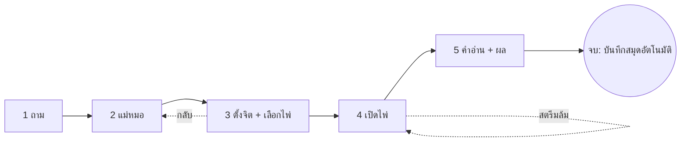

# 🎨 ดีไซน์แอป SeerTarot (iOS) — Workflow · UI · UX

> ฉบับออกแบบใหม่ 2026-09-29 · ต่อยอดจากแผน [`IOS_APP_PLAN`](../docs/plans/IOS_APP_PLAN_2026-09-29.md)
> เป้าหมาย: แอปที่ให้ความรู้สึก "พิธีเปิดไพ่" ไม่ใช่ฟอร์ม — และเป็นจุดต่างที่ตอบข้อ 4.3(b) ของ Apple ได้ตรงตัว

## 1. หลักการออกแบบ

| หลัก | ความหมายในแอป |
| :-- | :-- |
| **มือเดียว** | ปุ่มหลักอยู่ล่างจอ (Sticky Action Bar) ไม่ต้องเอื้อมขึ้นบน · เป้าแตะ ≥ 48pt |
| **รู้ตำแหน่งเสมอ** | พิธีเปิดไพ่มีแถบขั้นตอน 5 ขั้นตลอด · ปิดกลางทางต้องยืนยัน (กันเสียสิทธิ์) |
| **ผู้ใช้ทำเอง** | เลือกไพ่เอง · พลิกไพ่เอง (กฎเหล็กข้อ 4) — ไม่มีปุ่ม "พลิกทั้งหมด" |
| **หนึ่งขั้น หนึ่งเรื่อง** | แต่ละขั้นมีคำถามเดียว ลดการเลื่อนจอยาว ๆ ของเวอร์ชันแรก |
| **ให้เห็นความยุติธรรม** | คำมั่น (commitment) โชว์ก่อนเลือกไพ่ · ตราตรวจ Provably Fair หลังคำอ่าน |
| **สงบ ไม่ตกใจ** | การเคลื่อนไหวช้า นุ่ม · เคารพ "ลดการเคลื่อนไหว" ของระบบ · ห้ามอิโมจิการ์ตูน (ใช้ ✦) |

## 2. โครงการนำทาง

```
Tab Bar (5)  ── วันนี้ · เปิดไพ่ · สมุด · สารานุกรม · บัญชี
                  │
                  ├─ วันนี้    → ไพ่ประจำวัน · ทางลัดหัวข้อ (รัก/งาน/เงิน/ตัวเอง) · ทำนายด่วน 1 ใบ
                  ├─ เปิดไพ่   → เลือกผัง (ชิปหมวด + การ์ดผังพร้อมแผนที่ตำแหน่งย่อ)
                  │                     └─► [Full-screen Modal] พิธีเปิดไพ่ (ไม่มี Tab Bar)
                  ├─ สมุด      → ประวัติคำทำนาย (ล็อกอิน)
                  ├─ สารานุกรม → ไพ่ 78 ใบ (ออฟไลน์) → รายละเอียดไพ่ 5 มิติ
                  └─ บัญชี     → ล็อกอิน · ลบบัญชี · นโยบาย
```

## 3. Workflow "พิธีเปิดไพ่" (5 ขั้น)



| ขั้น | หน้าจอ | สิ่งที่ผู้ใช้ทำ | การเรียก API | จุดกันพลาด |
| :-: | :-- | :-- | :-- | :-- |
| 1 | **ถาม** | เลือกหัวข้อ (ชิป) → เลือกคำถามแนะนำหรือพิมพ์เอง | — | ไม่บังคับพิมพ์ (ผังด่วนเปิดได้ทันที) · เตือนสั้น ๆ ว่าห้ามใส่ข้อมูลส่วนตัวเกินจำเป็น |
| 2 | **แม่หมอ** | ปัดการ์ดแม่หมอ 5 บุคลิกแนวนอน แตะเลือก | `POST /reading/start` (ตอนกด "ต่อไป") | คำถามอันตราย → หน้าจอสายด่วน **1323** พร้อมปุ่มโทร · ยังไม่ล็อกอิน → ชวนเข้าสู่ระบบ **โดยเก็บคำถามไว้** |
| 3 | **ตั้งจิต → เลือกไพ่** | กดค้างวงกลม 3 วินาที (สั่นเป็นจังหวะ) → เลื่อนสำรับแนวนอน แตะเลือก N ใบ ช่องตำแหน่งด้านบนเติมทีละช่อง | `POST /shuffle` | โชว์คำมั่น SHA-256 ก่อนเลือก · เลือกครบจึงกดยืนยันได้ · แตะซ้ำ = ยกเลิกเลือก |
| 4 | **เปิดไพ่** | แตะไพ่แต่ละใบบนแผนผังจริงของผังนั้นเพื่อพลิก | — | ไพ่คว่ำเสมอ · ปุ่ม "ให้แม่หมออ่าน" ปลดล็อกเมื่อพลิกครบ · ไพ่ข้อมูลขาด = "โหลดใหม่อีกครั้ง" |
| 5 | **คำอ่าน** | อ่านคำอ่านที่ไหลเป็นส่วน ๆ · ฟังเสียง (TTS) · แชร์ · เปิดไพ่ใหม่ | `POST /read` (SSE) · `POST /journal` (เงียบ ๆ) | สตรีมขาดก่อน `done` = ไม่แสดงคำอ่านครึ่งเดียว ให้ลองใหม่ (ไม่เสียสิทธิ์ — หลังบ้านคืนให้) |

**ออกจากพิธีกลางทาง**: ปุ่ม ✕ ที่หัวจอ → แจ้งเตือนยืนยัน ("ออกตอนนี้ไพ่ที่เลือกไว้จะหายนะ") ยกเว้นขั้น 1–2 ที่ยังไม่มีอะไรเสีย

## 4. หน้าหลัก "วันนี้" (ประตูเดียว)

1. คำทักตามช่วงเวลา (เช้า/บ่าย/เย็น/ดึก) + วันที่ไทย
2. **ไพ่ประจำวัน** ใบใหญ่กลางจอ คว่ำ — แตะพลิก → ชื่อไพ่ + คำสำคัญ + ข้อความพลังงานวัน
3. ปุ่มหลัก **"ถามไพ่ตอนนี้"** (ไปพิธีเปิดไพ่ ผังแนะนำ = 3 ใบ)
4. **ทางลัดหัวข้อ 2×2**: ความรัก · การงาน · การเงิน · ตัวเอง → เปิดพิธีโดยเลือกหัวข้อและผังที่เหมาะให้แล้ว
5. **ทำนายด่วน 1 ใบ** (ผัง `quick`)

## 5. หน้าเลือกผัง

- ชิปหมวดเลื่อนแนวนอนได้ (จำนวนผังในชิปนับจากข้อมูลจริง ไม่เขียนเลขตาย)
- การ์ดผังแสดง **แผนที่ตำแหน่งย่อ** (จุดตามพิกัดจริงของผัง ใช้ `mapLayout` ตัวเดียวกับเว็บ) + จำนวนใบ + คำโปรย → ผู้ใช้เห็นหน้าตาผังก่อนเลือก

## 6. ระบบดีไซน์

- **สี**: โทเคนธีมกระจกอุ่นเดิม (`lib/theme.ts`) — ตัวอักษรหลัก `ink` บน `canvas` ผ่าน AA
- **ตัวอักษร**: ระบบ (SF Pro + Thonburi ไทย) · ชุดขนาด `title 28 / heading 20 / body 17 (lh 28) / caption 13` — ไทยต้องมี line-height ≥ 1.6 (กันสระ/วรรณยุกต์ถูกตัด INC-0197)
- **พื้นผิว**: การ์ดพื้นอุ่น + เงาบาง + ขอบทอง 1px · ปุ่มหลักทองเข้ม `goldInk` ตัวขาว · ปุ่มรองขอบทอง
- **การเคลื่อนไหว**: เปลี่ยนขั้นด้วย fade + เลื่อนสั้น ๆ (Reanimated) · พลิกไพ่ 3D 520ms · เคารพ Reduce Motion (ตัดเหลือ fade)
- **สั่น (Haptics)**: แตะเลือกไพ่ = เบา · พลิกไพ่ = กลาง · ตั้งจิตครบ = สำเร็จ
- **การเข้าถึง**: ทุกปุ่มมี `accessibilityLabel` · สถานะเลือก/ปิดใช้งานบอก VoiceOver · ไม่ใช้สีอย่างเดียวบอกสถานะ

### 6.1 ภาษาภาพ "Warm Liquid Glass" (ปรับรอบ 2)

| ชั้น | วิธีทำ |
| :-- | :-- |
| **พื้นหลัง** | ออโรราอุ่น (`AuroraBackground`): ฐานครีมไล่เฉด + ก้อนแสงทอง/กุหลาบ/ฟ้าหม่นลอยช้า ๆ แล้วเบลอรวม — กระจกจะสวยได้ต้องมีสีให้เบลอทับ |
| **กระจก** | `GlassSurface`: iOS 26 ใช้ Liquid Glass ของระบบ (`expo-glass-effect`) · iOS อื่น/เว็บ ใช้ `expo-blur` + แผ่นสีขาวโปร่ง + ไฮไลต์สะท้อนด้านบน + ขอบขาวบาง + เงานุ่มบนกล่องนอก |
| **สามระดับ** | `light` การ์ดทั่วไป · `strong` แผงที่ต้องอ่านง่าย (แท็บบาร์ แถบปุ่มล่าง ช่องพิมพ์) · `dark` จุดเน้น (สรุปคำแนะนำ ช่องไพ่ที่เลือกแล้ว) |
| **ปุ่มหลัก** | ทองไล่เฉด + ไฮไลต์ + เงาทอง · ปุ่มรอง/ชิป = กระจกขาว · เลือกแล้ว = ทองไล่เฉด |
| **การนำทาง** | แท็บบาร์กระจกลอยโค้งมน (ไอคอนเส้น Ionicons ไม่ใช่อิโมจิ) · ปุ่มย้อน/ปิดเป็นกระจกกลม · แผงปุ่มหลักลอยล่างจอ |
| **คอนทราสต์** | ตัวอักษรบนกระจกใช้ `ink` บนแผ่นโปร่ง alpha ≥ 0.4 (แท็บบาร์ 0.88 เพราะเนื้อหาเลื่อนผ่านใต้) — ห้ามลดจนอ่านยาก |

## 7. สถานะพิเศษ (Empty / Error / Loading)

| สถานการณ์ | พฤติกรรม |
| :-- | :-- |
| ไม่มีเน็ต | แถบแจ้ง + สารานุกรมยังใช้ได้ · เปิดไพ่ขึ้น "ต้องออนไลน์" |
| ข้อมูลไพ่ขาด/สตรีมขาด | ข้อความ "โหลดใหม่อีกครั้ง" + ปุ่ม (กฎเหล็กข้อ 14 — ห้ามกุไพ่) |
| โควตาหมด | บอกเวลารีเซ็ต · ไม่มีลิงก์ไปซื้อบนเว็บ (Apple 3.1.1) |
| สมุดว่าง | ภาพไพ่ + ปุ่ม "เปิดไพ่ใบแรก" |

## 8. ยังไม่รวมในรอบนี้

Onboarding 3 หน้า · Widget · Push · IAP · Sign in with Apple (รอบัญชี Apple Developer) · แชทถามต่อ · Dark mode
